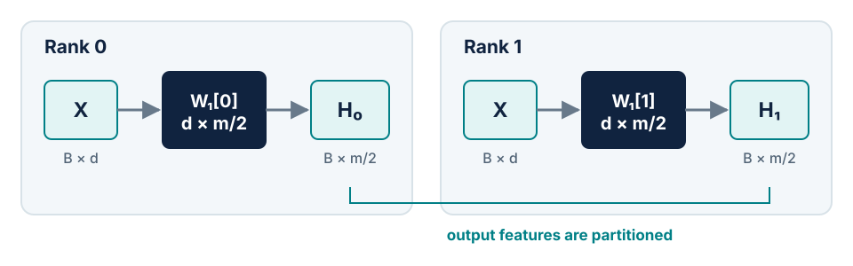
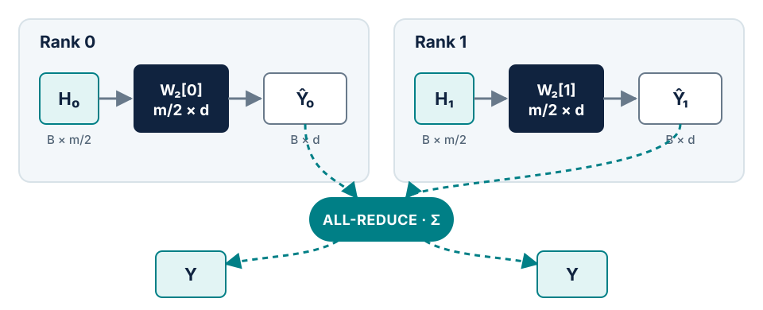
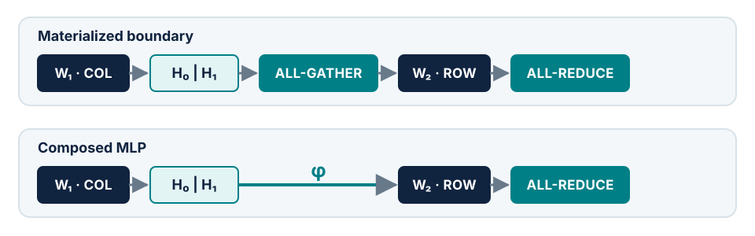

# Module 7 Lab — Implement & Verify Tensor Parallelism (Gloo)

This lab accompanies [Module 7: Tensor parallelism](../modules/07-tensor-parallelism.md).

!!! tip "Practical Lab Resources"
    To work through the hands-on implementation for this module:

    - **Lab script:** [`scripts/07_tensor_parallel.py`](https://github.com/brain-bzh/llm-course-companion/blob/main/scripts/07_tensor_parallel.py)
    - **Reference module:** [`nanolm/tensor_parallel.py`](https://github.com/brain-bzh/llm-course-companion/blob/main/nanolm/tensor_parallel.py)
    - **Unit tests:** [`tests/test_module_07_tp.py`](https://github.com/brain-bzh/llm-course-companion/blob/main/tests/test_module_07_tp.py)

---

## Objective

1. **Understand matrix partitioning mechanics**: Derive Column Parallelism and Row Parallelism from basic matrix multiplication.
2. **Eliminate intermediate communication**: Understand why pairing a Column-Parallel layer with a Row-Parallel layer allows an MLP to execute with only a single `all_reduce` collective.
3. **Implement with PyTorch's Gloo backend**: Build working `ColumnParallelLinear` and `RowParallelLinear` modules that run on CPU using `torch.distributed` and `backend="gloo"`, enabling distributed execution on any laptop or development environment.
4. **Verify numerical equivalence**: Prove that the parallelized MLP computes the exact mathematical output as a standard reference `nn.Linear` MLP ($|Y_{\text{TP}} - Y_{\text{ref}}| < 10^{-5}$).

---

## Part 1 — The Mathematics of Matrix Partitioning

Consider a standard linear layer mapping an input vector $X \in \mathbb{R}^{B \times d_{\text{in}}}$ to an output $Y \in \mathbb{R}^{B \times d_{\text{out}}}$ using weight matrix $W \in \mathbb{R}^{d_{\text{out}} \times d_{\text{in}}}$:

$$Y = X W^T$$

In Tensor Parallelism (TP), we divide $W$ across $P$ ranks (our tensor-parallel world size). There are two complementary ways to partition the matrix.

### 1. Column Parallelism (Partitioning Output Features)

We split $W$ along its output dimension (the columns of $W^T$):

$$W = \begin{bmatrix} W_0 \\ W_1 \\ \vdots \\ W_{P-1} \end{bmatrix}, \quad \text{where each } W_p \in \mathbb{R}^{\frac{d_{\text{out}}}{P} \times d_{\text{in}}}$$

Every rank receives the **full, replicated input** $X$ and multiplies it by its local weight shard $W_p$:

$$Y_p = X W_p^T \in \mathbb{R}^{B \times \frac{d_{\text{out}}}{P}}$$

<figure markdown="span">
  { loading=lazy }
  <figcaption>Each rank receives the identical input X and computes its own slice of the output features.</figcaption>
</figure>

- **Input:** Replicated across all ranks ($B \times d_{\text{in}}$).
- **Computation:** Completely independent (zero communication).
- **Output:** Sharded across ranks along the feature dimension ($B \times \frac{d_{\text{out}}}{P}$).

### 2. Row Parallelism (Partitioning Input Features)

We split $W$ along its input dimension (the rows of $W^T$):

$$W = \begin{bmatrix} W_0 & W_1 & \cdots & W_{P-1} \end{bmatrix}, \quad \text{where each } W_p \in \mathbb{R}^{d_{\text{out}} \times \frac{d_{\text{in}}}{P}}$$

Each rank $p$ receives a **sharded input** $X_p \in \mathbb{R}^{B \times \frac{d_{\text{in}}}{P}}$ matching its slice of the weights:

$$\hat{Y}_p = X_p W_p^T \in \mathbb{R}^{B \times d_{\text{out}}}$$

<figure markdown="span">
  { loading=lazy }
  <figcaption>Each rank computes a partial result; an all-reduce sums them to reproduce the full output.</figcaption>
</figure>

Notice that each $\hat{Y}_p$ has the full output dimension $d_{\text{out}}$, but represents only a **partial sum**. To recover the complete output $Y$, all ranks must sum their contributions:

$$Y = \sum_{p=0}^{P-1} \hat{Y}_p = \sum_{p=0}^{P-1} X_p W_p^T$$

This summation is performed using an **All-Reduce** collective with the `SUM` operator.

---

## Part 2 — The Megatron Composed MLP Pattern

Why not simply use Column Parallelism everywhere?

If a layer's output is sharded along the feature dimension, the next layer cannot consume it unless all ranks synchronize using an `all_gather` collective.

The breakthrough insight of Megatron-LM (Shoeybi et al., 2019) is that **Column Parallelism and Row Parallelism are exact duals**:

<figure markdown="span">
  { loading=lazy }
  <figcaption>The Column-to-Row chain: hidden representations remain sharded through the activation function, requiring only a single all-reduce at the end.</figcaption>
</figure>

1. **First projection ($W_1$, Column-Parallel):**
   $$H_p = X W_{1, p}^T \in \mathbb{R}^{B \times \frac{4d}{P}}$$
2. **Pointwise activation ($\text{GELU}$):**
   Because $\text{GELU}$ is an elementwise non-linearity, rank $p$ applies it directly to its local hidden shard:
   $$Z_p = \text{GELU}(H_p) \in \mathbb{R}^{B \times \frac{4d}{P}}$$
   **Zero communication is required.**
3. **Second projection ($W_2$, Row-Parallel):**
   $W_2$ partitions its input features along the exact same dimension that $Z_p$ is sharded along:
   $$\hat{Y}_p = Z_p W_{2, p}^T \in \mathbb{R}^{B \times d}$$
4. **Final All-Reduce:**
   A single collective sums the partial results across all ranks:
   $$Y = \text{all\_reduce}(\hat{Y}_p, \text{op}=\text{SUM}) \in \mathbb{R}^{B \times d}$$

The entire 2-layer MLP executes with **only one communication collective** in the forward pass.

---

## Part 3 — Implementation with PyTorch's Gloo Backend

To ensure that every student can run and test Tensor Parallelism on their local machine (including macOS laptops and CPU-only workstations), we use PyTorch's **`gloo`** distributed backend rather than NVIDIA NCCL.

### Column-Parallel Linear Layer

```python
import torch
import torch.nn as nn
import torch.nn.functional as F
import torch.distributed as dist

class ColumnParallelLinear(nn.Module):
    def __init__(self, in_features: int, out_features: int, world_size: int = 1, rank: int = 0):
        super().__init__()
        assert out_features % world_size == 0
        self.in_features = in_features
        self.out_features_per_partition = out_features // world_size
        self.world_size = world_size
        self.rank = rank

        # Each rank stores only 1/world_size of the output weights
        self.weight = nn.Parameter(torch.empty(self.out_features_per_partition, in_features))
        nn.init.normal_(self.weight, std=0.02)

    def forward(self, x: torch.Tensor) -> torch.Tensor:
        # Input is replicated [B, T, in_features]
        # Output is local shard [B, T, out_features / world_size]
        return F.linear(x, self.weight)
```

### Row-Parallel Linear Layer with All-Reduce

```python
class RowParallelLinear(nn.Module):
    def __init__(self, in_features: int, out_features: int, world_size: int = 1, rank: int = 0):
        super().__init__()
        assert in_features % world_size == 0
        self.in_features_per_partition = in_features // world_size
        self.out_features = out_features
        self.world_size = world_size
        self.rank = rank

        # Each rank stores only 1/world_size of the input weights
        self.weight = nn.Parameter(torch.empty(out_features, self.in_features_per_partition))
        nn.init.normal_(self.weight, std=0.02)

    def forward(self, x: torch.Tensor) -> torch.Tensor:
        # Local matrix multiplication produces partial output: [B, T, out_features]
        output_parallel = F.linear(x, self.weight)

        # Cross-rank All-Reduce sum
        if self.world_size > 1 and dist.is_available() and dist.is_initialized():
            dist.all_reduce(output_parallel, op=dist.ReduceOp.SUM)

        return output_parallel
```

### Composing the Sharded MLP

```python
class ShardedMLP(nn.Module):
    def __init__(self, n_embd: int, world_size: int = 1, rank: int = 0):
        super().__init__()
        self.fc1 = ColumnParallelLinear(n_embd, 4 * n_embd, world_size=world_size, rank=rank)
        self.gelu = nn.GELU(approximate="tanh")
        self.fc2 = RowParallelLinear(4 * n_embd, n_embd, world_size=world_size, rank=rank)

    def forward(self, x: torch.Tensor) -> torch.Tensor:
        # x is replicated: [B, T, n_embd]
        h_sharded = self.gelu(self.fc1(x))  # [B, T, 4 * n_embd / world_size]
        out_replicated = self.fc2(h_sharded) # [B, T, n_embd] via all-reduce
        return out_replicated
```

---

## Part 4 — Verification & Equivalence Test

We test our parallel layer against a standard single-process reference layer:

```bash
uv run python scripts/07_tensor_parallel.py
```

### Multi-Rank Worker Execution (Gloo CPU)

Below is the complete runner function to spawn real distributed worker processes using `gloo`:

```python
import os
import torch
import torch.distributed as dist
import torch.multiprocessing as mp

def run_worker(rank: int, world_size: int, shared_x, shared_w1, shared_w2, result_queue):
    # Initialize Gloo process group over local loopback TCP
    os.environ["MASTER_ADDR"] = "127.0.0.1"
    os.environ["MASTER_PORT"] = "29500"
    dist.init_process_group(backend="gloo", rank=rank, world_size=world_size)

    n_embd = shared_x.shape[-1]
    d_ff = 4 * n_embd

    # Instantiate sharded layers for this rank
    mlp = ShardedMLP(n_embd, world_size=world_size, rank=rank)

    # Slice weights from the reference model
    with torch.no_grad():
        mlp.fc1.weight.copy_(shared_w1[rank * (d_ff // world_size) : (rank + 1) * (d_ff // world_size), :])
        mlp.fc2.weight.copy_(shared_w2[:, rank * (d_ff // world_size) : (rank + 1) * (d_ff // world_size)])

    # Forward pass (all-reduce occurs inside RowParallelLinear)
    y_tp = mlp(shared_x)

    if rank == 0:
        result_queue.put(y_tp)

    dist.destroy_process_group()
```

### Expected Output

```text
=== Module 7: Tensor Parallelism Toy Layer ===
Column + Row Parallel MLP output shape: [2, 4, 64]
Max absolute difference vs reference: 0.00e+00
SUCCESS: Simulated Tensor Parallel MLP is mathematically identical to reference MLP.
```
