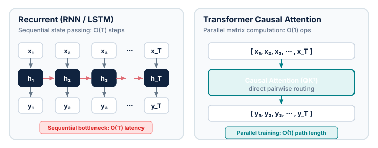
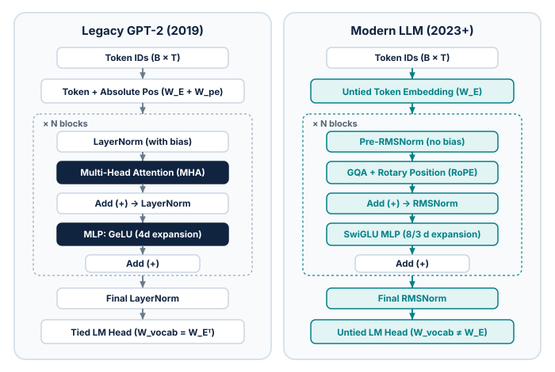

# Module 1 — Transformer from first principles

## Purpose

Build a mental model of the decoder-only Transformer, then turn that
model into the smallest implementation you can fully inspect.

This module follows the component-by-component progression of
[The Annotated Transformer](https://nlp.seas.harvard.edu/annotated-transformer/),
but adapts its original encoder–decoder model to the causal decoder-only model
we will train during the course.

## Key ideas

- represent tokens as vectors and add position information;
- derive scaled dot-product attention from queries, keys and values;
- make self-attention causal with a mask;
- combine multiple attention heads;
- compose attention and an MLP through residual connections and normalization;
- project the final hidden states to next-token logits.

---

## The task: Next-token prediction

At its theoretical foundation, generative language modeling casts the generation of text as estimating the joint probability distribution over an ordered sequence of discrete tokens:

$$P(x_1, x_2, \dots, x_T) = \prod_{t=1}^T P(x_t \mid x_1, \dots, x_{t-1}) = \prod_{t=1}^T P(x_t \mid x_{<t}).$$

By the chain rule of probability, this high-dimensional joint distribution factorizes exactly into a sequence of conditional distributions. The model's core objective is **next-token prediction (NTP)**: given an observed context of prefix tokens $x_{<t} = (x_1, \dots, x_{t-1})$, compute a probability distribution over the vocabulary $\mathcal{V}$ for the subsequent token $x_t$.

Training maximizes the log-likelihood of ground-truth sequences sampled from a vast pretraining corpus $\mathcal{D}$, minimizing empirical cross-entropy loss:

$$\mathcal{L}_{\text{NTP}}(\theta) = -\frac{1}{T}\sum_{t=1}^T \log P_\theta(x_t \mid x_{<t}).$$

### What is a token?

Before a neural network can process text, the text must be converted into numerical values:

- **Conceptually:** A token is a discrete unit of text—typically a subword fragment, a common word, or a punctuation mark—indexed by an integer $x_t \in \{0, 1, \dots, |\mathcal{V}| - 1\}$.
- **In Module 1:** For building the neural network architecture, tokens are treated simply as integer indices. An embedding matrix $W_E \in \mathbb{R}^{|\mathcal{V}| \times d_{\text{model}}}$ maps each integer ID to a continuous dense vector in hidden space.
- **In Module 3:** The exact algorithms that segment unicode strings into token IDs (such as Byte-Pair Encoding and regex pre-tokenization) will be explored and implemented from scratch.

---

## Historical next-token prediction: The recurrent era

Long before the Transformer, next-token prediction was dominated by recurrent architectures: Elman Recurrent Neural Networks ([Elman, 1990](https://doi.org/10.1016/0364-0213(90)90002-E)), Long Short-Term Memory networks (LSTM; [Hochreiter & Schmidhuber, 1997](https://doi.org/10.1162/neco.1997.9.8.1735)), and Gated Recurrent Units (GRU; [Cho et al., 2014](https://doi.org/10.3115/v1/D14-1179)).

Recurrent architectures model language sequentially as a discrete-time dynamical system. As the model ingests token $x_t$, it updates a recurrent hidden vector $h_t \in \mathbb{R}^d$ through a parameterized transition function:

$$h_t = f(W_{hh} h_{t-1} + W_{xh} x_t + b_h),$$

$$P(x_{t+1} \mid x_{\le t}) = \operatorname{softmax}(W_{\text{out}} h_t + b_{\text{out}}).$$

To preserve longer dependencies, LSTMs augmented the simple recurrent cell with an additive internal cell state $c_t$ governed by input, forget, and output gating mechanisms:

$$f_t = \sigma(W_f [h_{t-1}, x_t] + b_f), \quad i_t = \sigma(W_i [h_{t-1}, x_t] + b_i), \quad o_t = \sigma(W_o [h_{t-1}, x_t] + b_o),$$

$$c_t = f_t \odot c_{t-1} + i_t \odot \tanh(W_c [h_{t-1}, x_t] + b_c), \quad h_t = o_t \odot \tanh(c_t).$$

While recurrent networks demonstrated that neural language models could outperform classical $n$-gram statistical models ([Bengio et al., 2003](https://www.jmlr.org/papers/v3/bengio03a.html)), they suffered from two fundamental bottlenecks that prevented scaling to large foundation models.

---

## The sequential bottleneck of RNNs and LSTMs

The limitations of recurrent language models stem directly from their mathematical formulation:

### 1. The computational training bottleneck: $O(T)$ sequential steps

Computing the hidden state $h_t$ strictly requires the prior hidden state $h_{t-1}$. Consequently:

- **No temporal parallelization during training:** Forward and backward passes cannot execute step $t$ until step $t-1$ has finished. For a context window of length $T$, the training loop must step through $T$ sequential matrix-vector operations.
- **Hardware underutilization:** Modern accelerators (such as NVIDIA GPUs and Google TPUs) achieve peak throughput by performing massive, simultaneous parallel matrix multiplications across thousands of Tensor Cores. Recurrent loops force GPUs to execute sequentially over time, starving compute units and leaving memory bandwidth underutilized.

### 2. The information and gradient bottleneck: $O(T)$ interaction path

- **Fixed-capacity compression:** The hidden vector $h_t \in \mathbb{R}^d$ has a fixed dimensionality. Compressing an entire variable-length prefix $x_1, \dots, x_t$ into a single vector inevitably causes catastrophic forgetting of early context.
- **Vanishing and exploding gradients:** Training recurrent networks over long contexts relies on Backpropagation Through Time (BPTT). Computing the gradient of the loss at step $T$ with respect to the hidden state at step 1 expands through a product of $T-1$ Jacobians ([Pascanu et al., 2013](https://proceedings.mlr.press/v28/pascanu13.html)):

  $$\frac{\partial h_T}{\partial h_1} = \prod_{k=2}^T \frac{\partial h_k}{\partial h_{k-1}} = \prod_{k=2}^T \operatorname{diag}\left(1 - \tanh^2(\cdot)\right) W_{hh}^\top.$$

  If the largest singular value of $W_{hh}$ is less than 1, gradients decay exponentially toward zero as $T$ grows; if greater than 1, gradients explode. Even LSTMs, which introduce an additive highway for cell state gradients, struggle to maintain effective credit assignment beyond several hundred steps.
- **Interaction path length:** For information at position $i$ to influence position $j$, it must traverse $O(|j - i|)$ intermediate transformations.

---

## The parallel revolution: The Transformer

The Transformer architecture ([Vaswani et al., 2017](https://arxiv.org/abs/1706.03762)) shattered both bottlenecks by dispensing with recurrence entirely:

1. **$O(1)$ sequential operations during training:** Rather than stepping token by token, the Transformer processes all $T$ positions simultaneously. In causal language modeling, masking prevents future tokens from contaminating earlier positions, allowing the entire sequence forward and backward pass to execute as dense, highly parallel matrix multiplications.
2. **Direct $O(1)$ path length:** Every token attends directly to every preceding token through a single self-attention operation. Information does not need to traverse an intermediate chain of recurrent states; the effective interaction distance between any two tokens across the sequence is $O(1)$.

<figure markdown="span">
  { loading=lazy }
  <figcaption>The paradigm shift: Recurrent models suffer from an $O(T)$ sequential compute dependency and gradient decay, whereas causal self-attention computes all interactions concurrently with an $O(1)$ direct path.</figcaption>
</figure>

---

## Key component: Self-attention

At the heart of the Transformer's capability is **self-attention** ([Bahdanau et al., 2014](https://arxiv.org/abs/1409.0473); [Vaswani et al., 2017](https://arxiv.org/abs/1706.03762)). Self-attention acts as a differentiable, content-addressable associative memory:

- **Queries ($Q = X W_Q$):** Represent what each token position is actively searching for.
- **Keys ($K = X W_K$):** Represent what each token position contains or offers.
- **Values ($V = X W_V$):** Represent the actual information or feature content to be transmitted.

For a single attention head, the operation is defined as:

$$\operatorname{Attention}(Q, K, V) = \operatorname{softmax}\left(\frac{Q K^\top}{\sqrt{d_{\text{head}}}} + M\right) V.$$

### Why divide by $\sqrt{d_{\text{head}}}$?

Assuming the elements of $q$ and $k$ are independent random variables with zero mean and unit variance:

$$q^\top k = \sum_{i=1}^{d_{\text{head}}} q_i k_i, \quad \mathbb{E}[q^\top k] = 0, \quad \operatorname{Var}(q^\top k) = d_{\text{head}}.$$

As the head dimension $d_{\text{head}}$ grows large, the variance of the dot products scales as $d_{\text{head}}$, meaning typical values have magnitude $\sqrt{d_{\text{head}}}$. Without the scaling factor $1/\sqrt{d_{\text{head}}}$, large dot products push the softmax function into regions with near-zero gradients, causing training to stall. Scaling stabilizes the variance of the attention logits to 1 regardless of head width.

### Division of labor: Attention vs. MLP

A common misconception is that self-attention performs all the computation in a Transformer. In reality, a Transformer block cleanly decouples two distinct computational roles:

- **Self-attention:** Performs **cross-token communication**. It routes and mixes information across sequence positions (along the time/space axis), applying linear projections per token.
- **Feed-Forward MLP:** Performs **per-token transformation**. It operates on each token representation independently (along the channel/feature axis), applying non-linear expansions and contractions to synthesize complex representations.

---

## The architectural lineage: From original encoder–decoder to legacy GPT-2

When Vaswani et al. introduced the Transformer in 2017, the model was formulated as an **Encoder–Decoder** network specifically designed for sequence-to-sequence machine translation (e.g., English to German):

- An **Encoder** processed the complete source sentence bidirectionally (tokens attend to all past and future tokens).
- A **Decoder** generated the target translation autoregressively, combining causal self-attention on already generated target tokens with **cross-attention** over the encoder's output representations.

In the years following 2017, the NLP community explored three distinct architectural configurations:

1. **Encoder-only (e.g., BERT; [Devlin et al., 2018](https://arxiv.org/abs/1810.04805)):** Employs bidirectional self-attention to generate rich contextual representations for classification, named entity recognition, and semantic search. It cannot perform autoregressive generation directly.
2. **Encoder–Decoder (e.g., T5; [Raffel et al., 2019](https://arxiv.org/abs/1910.10683); BART; [Lewis et al., 2020](https://arxiv.org/abs/1910.13461)):** Preserves the two-stack design for paired sequence-to-sequence transformation tasks such as summarization and formal translation.
3. **Decoder-only (e.g., GPT-1/2/3; [Radford et al., 2018](https://cdn.openai.com/research-covers/language-unsupervised/language_understanding_paper.pdf), [2019](https://cdn.openai.com/better-language-models/language_models_are_unsupervised_multitask_learners.pdf); [Brown et al., 2020](https://arxiv.org/abs/2005.14165)):** Discards the encoder entirely. The model consists solely of repeated causal self-attention and MLP blocks operating on a single token stream.

### Why decoder-only became the foundation of modern LLMs

The decoder-only architecture quickly displaced encoder–decoder models as the dominant foundation for general-purpose language models:

- **Universal task unification:** Any natural language task—from machine translation and code generation to reasoning and summarization—can be framed naturally as next-token prediction on a prompt prefix ([Radford et al., 2019](https://cdn.openai.com/better-language-models/language_models_are_unsupervised_multitask_learners.pdf)).
- **Emergence of in-context learning:** Causal autoregressive pretraining at scale gives rise to few-shot and zero-shot prompting capabilities without task-specific fine-tuning heads ([Brown et al., 2020](https://arxiv.org/abs/2005.14165)).
- **Serving and caching simplicity:** Decoder-only models maintain a single Key-Value (KV) cache stream, significantly simplifying memory management and high-throughput inference serving.

### Anatomy of legacy decoder-only: GPT-2 (2019)

OpenAI's **GPT-2** ([Radford et al., 2019](https://cdn.openai.com/better-language-models/language_models_are_unsupervised_multitask_learners.pdf)) established the canonical decoder-only baseline:

- **Embeddings:** Learned token embeddings ($W_E \in \mathbb{R}^{V \times d}$) summed with learned absolute 1D positional embeddings ($W_{pe} \in \mathbb{R}^{\text{block\_size} \times d}$).
- **Pre-LayerNorm:** Layer normalization ([Ba et al., 2016](https://arxiv.org/abs/1607.06450)) placed on the residual branches before attention and MLP layers (Pre-LN), resolving the vanishing/exploding gradient problems of the original post-norm Transformer ([Xiong et al., 2020](https://arxiv.org/abs/2002.04745)).
- **Standard Multi-Head Attention (MHA):** $H$ independent query, key, and value heads.
- **Standard MLP:** A 2-layer projection expanding the hidden dimension by $4\times$ with Gaussian Error Linear Unit (GeLU; [Hendrycks & Gimpel, 2016](https://arxiv.org/abs/1606.08415)) activation:

  $$\operatorname{MLP}(x) = \operatorname{GeLU}(x W_1 + b_1) W_2 + b_2.$$

- **Weight tying:** Tying the weights of the input token embedding and the output language-model projection head ($W_{\text{vocab}} = W_E^\top$; [Press & Wolf, 2017](https://arxiv.org/abs/1608.05859)).

---

## The modern Transformer stack: What changed since GPT-2

While the macro-structure of repeated causal attention and MLP blocks remains unchanged, contemporary foundation models (such as **LLaMA** [[Touvron et al., 2023]](https://arxiv.org/abs/2302.13971), **Mistral** [[Jiang et al., 2023]](https://arxiv.org/abs/2310.06825), **Gemma** [[Gemma Team, 2024]](https://arxiv.org/abs/2403.08295), and **DeepSeek** [[DeepSeek-AI, 2024]](https://arxiv.org/abs/2401.06066)) have systematically refined individual components for superior stability, memory efficiency, and inference speed.

### 1. Normalization: LayerNorm $\to$ Pre-RMSNorm

Standard Layer Normalization ([Ba et al., 2016](https://arxiv.org/abs/1607.06450)) centers activations around their mean before scaling by their standard deviation:

$$\text{LN}(x) = \frac{x - \mu}{\sqrt{\sigma^2 + \epsilon}} \odot \gamma + \beta, \quad \mu = \frac{1}{d}\sum_{i=1}^d x_i, \quad \sigma^2 = \frac{1}{d}\sum_{i=1}^d (x_i - \mu)^2.$$

[Zhang & Sennrich (2019)](https://arxiv.org/abs/1910.07467) showed that the mean-centering step ($\mu$) contributes negligible regularization or gradient stabilization; the primary benefit of normalization arises solely from scaling invariance. **RMSNorm** drops mean calculation and centering entirely:

$$\text{RMSNorm}(x) = \frac{x}{\operatorname{RMS}(x)} \odot \gamma, \quad \operatorname{RMS}(x) = \sqrt{\frac{1}{d}\sum_{i=1}^d x_i^2 + \epsilon}.$$

RMSNorm reduces memory reads and arithmetic overhead, yielding a 10% to 50% speedup per normalization layer while maintaining identical training dynamics. Modern models also omit the additive bias $\beta$.

### 2. Positional encodings: Absolute learned $\to$ Rotary Position Embedding (RoPE)

GPT-2 adds a learned absolute position vector $W_{pe}[t]$ to the token embedding at the input. This has severe limitations:

- Position information attenuates as representations pass through deep residual layers.
- It cannot generalize to sequence lengths beyond the hardcoded $\text{block\_size}$ seen during pretraining.

**Rotary Position Embedding (RoPE; [Su et al., 2021](https://arxiv.org/abs/2104.09864))** encodes position geometrically by rotating Query and Key vectors in 2D planes within the self-attention layer. For a 2D subvector $(q^{(2i)}, q^{(2i+1)})$ at position $m$, RoPE applies an orthogonal rotation matrix $R_{\Theta, m}^d$:

$$\tilde{q}_m = R_{\Theta, m}^d q_m, \quad \tilde{k}_n = R_{\Theta, n}^d k_n.$$

Crucially, the inner product between a rotated query at position $m$ and a rotated key at position $n$ depends **only on their relative distance $m - n$**:

$$\langle R_{\Theta, m}^d q_m, R_{\Theta, n}^d k_n \rangle = q_m^\top (R_{\Theta, m}^d)^\top R_{\Theta, n}^d k_n = q_m^\top R_{\Theta, n - m}^d k_n = g(q_m, k_n, m - n).$$

RoPE introduces zero learned parameters, naturally preserves relative distance decay, and allows context length extension (e.g., via NTK-aware interpolation or YaRN) without retraining the base architecture.

### 3. Activation functions: GeLU $\to$ SwiGLU

Standard Transformers use a single feed-forward projection followed by a non-linear activation like GeLU. [Shazeer (2020)](https://arxiv.org/abs/2002.05202) introduced **Gated Linear Unit (GLU)** variants, showing that multiplying a linear projection elementwise with a gated non-linear activation significantly improves representation capacity:

$$\operatorname{SwiGLU}(x) = \left( \operatorname{Swish}(x W_{\text{gate}}) \odot x W_{\text{up}} \right) W_{\text{down}},$$

where $\operatorname{Swish}(z) = z \cdot \sigma(\beta z)$ (often with $\beta = 1$, also known as $\text{SiLU}$).

Because SwiGLU introduces three weight matrices ($W_{\text{gate}}, W_{\text{up}}, W_{\text{down}}$) instead of two ($W_1, W_2$), modern models reduce the intermediate hidden expansion dimension from $4d$ to approximately $\frac{8}{3}d$ (or the nearest multiple of 256 or 64). This preserves the total parameter count and floating-point operations while consistently yielding lower perplexity across scales.

### 4. Attention variants: Multi-Head Attention (MHA) $\to$ Grouped-Query Attention (GQA)

During autoregressive inference generation, tokens are generated one by one. The model must load the entire Key-Value (KV) cache from high-bandwidth GPU memory (HBM) into SRAM at every step. This makes generation severely **memory-bandwidth bound** rather than compute bound ([Shazeer, 2019](https://arxiv.org/abs/1911.02150)).

- **Multi-Head Attention (MHA):** Has $H$ query, $H$ key, and $H$ value heads. The KV cache footprint scales as $2 \times B \times T \times H \times d_{\text{head}}$.
- **Multi-Query Attention (MQA; [Shazeer, 2019](https://arxiv.org/abs/1911.02150)):** Collapses all Key and Value heads into a single head shared across all $H$ Query heads. This reduces KV cache size by a factor of $H$, but can lead to quality degradation and training instability.
- **Grouped-Query Attention (GQA; [Ainslie et al., 2023](https://arxiv.org/abs/2305.13245)):** Groups $H_Q$ Query heads into $G$ groups, assigning one Key and Value head per group (where $1 < G < H_Q$). For instance, with 32 Query heads and 8 Key-Value groups ($G=8$), four Query heads share each Key-Value head ($4:1$ ratio). GQA delivers nearly the full quality of MHA while slashing KV-cache memory traffic by $4\times$ to $8\times$.

### 5. Output projection: Tied embeddings $\to$ Untied embeddings

In early models like GPT-2, weight tying ($W_{\text{vocab}} = W_E^\top$) was favored to save parameter footprint ([Press & Wolf, 2017](https://arxiv.org/abs/1608.05859)). For GPT-2 Small ($d=768, V=50,257$), tying saved $\approx 38.6\text{M}$ parameters (over 30% of total parameters).

In modern LLMs with $d \ge 4096$ and large vocabularies ($V \ge 32\text{k} - 128\text{k}$), models frequently **untie** input and output embeddings:

- **Representation tension:** The input embedding table maps sparse token IDs to a continuous latent space where semantic similarity is Euclidean. The output projection matrix acts as a classifier hyperplane discriminating between mutually exclusive tokens. Tying forces both roles to share identical geometry, creating gradient interference during optimization.
- **Parameter fraction:** In multi-billion parameter models, the embedding table constitutes a much smaller fraction of total capacity, making untying affordable and beneficial for convergence.

### 6. Parameter hygiene: Bias-free layers

Following [PaLM](https://arxiv.org/abs/2204.02311) and [LLaMA](https://arxiv.org/abs/2302.13971), modern architectures omit all additive bias terms ($b = 0$) across linear projection layers, attention projections, and normalization layers:

- **Arithmetic throughput:** Bias-free matrix multiplications map cleanly to fused GEMM kernels on GPUs without trailing elementwise addition kernels.
- **Training stability:** Removing biases prevents activation drift in very deep networks and stabilizes half-precision (`bfloat16`/`float16`) training.

---

## Architectural recap: Legacy GPT-2 vs. Modern LLM

The table below synthesizes the structural evolution from the legacy GPT-2 baseline to the modern generative stack:

| Architectural Component | Legacy Decoder-Only (GPT-2, 2019) | Modern Decoder-Only (LLaMA / Mistral / Gemma, 2023+) | Primary Rationale & Reference |
| :--- | :--- | :--- | :--- |
| **Positional Encoding** | Absolute learned 1D ($W_{pe}$) added to input embeddings | Rotary Position Embedding (**RoPE**) applied to $Q$ and $K$ | Preserves relative distance, zero learned parameters, enables length extrapolation ([Su et al., 2021](https://arxiv.org/abs/2104.09864)) |
| **Normalization Layer** | LayerNorm (mean subtraction + variance scaling) | **RMSNorm** (root-mean-square scaling only) | Eliminates mean calculation overhead; 10–50% faster normalization ([Zhang & Sennrich, 2019](https://arxiv.org/abs/1910.07467)) |
| **Normalization Placement** | Pre-LayerNorm ($X + \text{Sublayer}(\text{LN}(X))$) | **Pre-RMSNorm** | Maintains direct identity gradient highway across depth ([Xiong et al., 2020](https://arxiv.org/abs/2002.04745)) |
| **Attention Variant** | Multi-Head Attention (**MHA**; $H_Q = H_K = H_V$) | Grouped-Query Attention (**GQA**; $H_Q > H_{KV}$) | Reduces KV cache footprint and memory bandwidth by $4\times$–$8\times$ during decode ([Ainslie et al., 2023](https://arxiv.org/abs/2305.13245)) |
| **MLP Non-Linearity** | GeLU ($\text{GeLU}(x W_1) W_2$) with $4d$ expansion | **SwiGLU** ($(\text{Swish}(x W_{\text{gate}}) \odot x W_{\text{up}}) W_{\text{down}}$) with $\approx \frac{8}{3}d$ expansion | Bilinear gating mechanism provides higher capacity per parameter ([Shazeer, 2020](https://arxiv.org/abs/2002.05202)) |
| **Input/Output Embeddings**| **Tied weights** ($W_{\text{vocab}} = W_E^\top$) | **Untied weights** ($W_{\text{vocab}} \neq W_E$) | Decouples input semantic representation from output logit discrimination ([Touvron et al., 2023](https://arxiv.org/abs/2302.13971)) |
| **Linear Biases** | Included in all linear and norm layers | **Bias-free** ($b = 0$ everywhere) | Reduces memory reads, avoids activation drift, stabilizes deep training ([Chowdhery et al., 2022](https://arxiv.org/abs/2204.02311)) |
| **Attention Scaling** | Scale factor $1/\sqrt{d_{\text{head}}}$ | Scale factor $1/\sqrt{d_{\text{head}}}$ | Variance control prevents vanishing softmax gradients ([Vaswani et al., 2017](https://arxiv.org/abs/1706.03762)) |

<figure markdown="span">
  { loading=lazy }
  <figcaption>The modern decoder-only stack: Upgrading from GPT-2's learned positions, LayerNorm, and standard MLP to RoPE, RMSNorm, GQA, and SwiGLU transforms training throughput and serving memory efficiency.</figcaption>
</figure>

---

## From token IDs to representations

The model receives integer token IDs with shape `B × T`: batch size by sequence
length. An embedding table maps each token to a vector of width `d_model`, giving
`X ∈ B × T × d_model`.

Attention alone does not know whether a token came first or last. The original
Transformer adds sinusoidal position vectors. GPT-2 learns absolute position
embeddings, while many newer LLMs apply rotary position embeddings inside
attention. For the first implementation, the important invariant is simply that
token content and position both reach the block.

## Scaled dot-product attention

Each token representation is projected into a query, a key and a value:

`Q = XW_Q`, `K = XW_K`, `V = XW_V`.

Queries and keys determine which positions interact. Values carry the content
that is mixed. For one attention head:

`Attention(Q, K, V) = softmax(QKᵀ / √d_head + mask)V`.

The division by `√d_head` keeps dot products from growing with the head width.
The softmax acts across key positions, so every query row becomes a probability
distribution over the context it is allowed to see.

## Causal masking

During next-token prediction, position `t` may use tokens `0 … t`, but it must
not inspect future tokens. The causal mask sets forbidden attention logits to a
very negative value before the softmax.

<figure markdown="span">
  { loading=lazy }
  <figcaption>The lower triangle is visible; the upper triangle is blocked.</figcaption>
</figure>

Mask the **logits**, not the post-softmax probabilities. Test causality by
changing a future token and verifying that all earlier output positions remain
unchanged.

## Multi-head attention

Instead of one attention operation at width `d_model`, split the representation
into `n_head` subspaces of width `d_head = d_model / n_head`. Each head performs
its own attention computation, then the head outputs are concatenated and mixed
through an output projection.

Track these shapes explicitly:

- input: `B × T × d_model`;
- projected Q, K and V: `B × n_head × T × d_head`;
- attention scores: `B × n_head × T × T`;
- concatenated head output: `B × T × d_model`.

Multi-head attention changes how information is mixed **between tokens**. The
MLP that follows changes each token representation independently.

## The decoder-only block

The course model repeats one block containing causal self-attention and an MLP.
Residual paths preserve a direct route for information and gradients; the
normalization layers control the scale entering each sublayer.

<figure markdown="span">
  { loading=lazy }
  <figcaption>A minimal decoder-only language model, separated from the original encoder–decoder architecture.</figcaption>
</figure>

The Annotated Transformer implements the original post-norm residual form. Most
modern decoder-only LLMs use a pre-norm arrangement instead:

`X ← X + Attention(Norm(X))`

`X ← X + MLP(Norm(X))`

Do not silently mix the two conventions. The placement of normalization changes
the code path and training behaviour even when the same components are present.

## Logits and next-token prediction

After the final block, a normalization and linear language-model head map every
hidden vector to `V` vocabulary logits. Training compares logits at position
`t` with the token at position `t + 1` using cross-entropy.

The complete data flow is:

`token IDs → embeddings → N Transformer blocks → final norm → LM head → logits → cross-entropy`

The model output and target sequence are shifted by one position. Padding, if
present, must also be excluded from the loss.

## Practical task

Implement the smallest readable decoder-only Transformer:

1. token and position representations;
2. one causal self-attention module;
3. multi-head reshaping and output projection;
4. a pre-norm residual block with an MLP;
5. a repeated block stack, final normalization and LM head;
6. shape, masking and tiny-batch overfitting tests.

## Expected output

A model that completes a forward and backward pass, cannot observe future
tokens, and can overfit a tiny batch. Every intermediate tensor shape should be
explainable without running the code.

## Where this architecture fits

The word *Transformer* covers three high-level families. The distinction is
primarily the direction of self-attention and whether a separate encoder is
connected to the generator.

<figure markdown="span">
  { loading=lazy }
  <figcaption>Three model families built from closely related attention blocks.</figcaption>
</figure>

- **Encoder-only:** bidirectional context produces representations for
  classification, retrieval or token-level prediction; BERT is the canonical
  example.
- **Encoder–decoder:** a bidirectional encoder represents the source and a
  causal decoder generates the target through cross-attention; the original
  Transformer and T5 follow this family.
- **Decoder-only:** causal attention turns one token stream into a next-token
  prediction problem; GPT-style models and most current generative LLMs use
  this family.

This family-level taxonomy is only the first layer of comparison. Sebastian
Raschka's [LLM Architecture Gallery](https://sebastianraschka.com/llm-architecture-gallery/)
shows how decoder-only models then vary along several mostly independent axes:

- dense MLPs versus sparse mixture-of-experts layers;
- MHA, GQA, MLA, local/sliding-window or hybrid attention;
- learned positions, RoPE or layers without explicit positional encoding;
- normalization placement, activation functions and repeated layer recipes.

Use the gallery at the end of the module to compare GPT-2 with a modern model.
First identify what stayed structurally the same, then isolate which components
changed and what memory, optimization or inference trade-off each change targets.

## References

- [The Annotated Transformer](https://nlp.seas.harvard.edu/annotated-transformer/)
  — the main component-by-component reference for this module;
- [Vaswani et al. (2017) — Attention Is All You Need](https://arxiv.org/abs/1706.03762)
  — the seminal paper introducing the Transformer and multi-head attention;
- [Radford et al. (2019) — Language Models are Unsupervised Multitask Learners](https://cdn.openai.com/better-language-models/language_models_are_unsupervised_multitask_learners.pdf)
  — the foundational GPT-2 decoder-only architecture report;
- [Zhang & Sennrich (2019) — Root Mean Square Layer Normalization](https://arxiv.org/abs/1910.07467)
  — analysis and derivation of RMSNorm;
- [Shazeer (2020) — GLU Variants Improve Transformer](https://arxiv.org/abs/2002.05202)
  — derivation and empirical validation of SwiGLU;
- [Su et al. (2021) — RoFormer: Enhanced Transformer with Rotary Position Embedding](https://arxiv.org/abs/2104.09864)
  — mathematical formulation of RoPE;
- [Ainslie et al. (2023) — GQA: Training Generalized Multi-Query Transformer Models](https://arxiv.org/abs/2305.13245)
  — Grouped-Query Attention for KV-cache memory bandwidth reduction;
- [Shazeer (2019) — Fast Transformer Decoding: One Write-Head is All You Need](https://arxiv.org/abs/1911.02150)
  — the original Multi-Query Attention (MQA) paper identifying the decode memory bandwidth bottleneck;
- [Touvron et al. (2023) — LLaMA: Open and Efficient Foundation Language Models](https://arxiv.org/abs/2302.13971)
  — reference modern open-weight LLM stack combining RMSNorm, SwiGLU, and RoPE;
- [Bengio et al. (2003) — A Neural Probabilistic Language Model](https://www.jmlr.org/papers/v3/bengio03a.html)
  — the foundational paper on neural next-token language modeling;
- [Hochreiter & Schmidhuber (1997) — Long Short-Term Memory](https://doi.org/10.1162/neco.1997.9.8.1735)
  — introducing the LSTM architecture to mitigate vanishing gradients in recurrence;
- [Pascanu, Mikolov & Bengio (2013) — On the difficulty of training recurrent neural networks](https://proceedings.mlr.press/v28/pascanu13.html)
  — mathematical analysis of exploding and vanishing gradients in recurrent networks;
- [Press & Wolf (2017) — Using the Output Embedding to Improve Language Models](https://arxiv.org/abs/1608.05859)
  — analysis and evaluation of weight tying;
- [Xiong et al. (2020) — On Layer Normalization in the Transformer Architecture](https://arxiv.org/abs/2002.04745)
  — theoretical and empirical study of Pre-LN vs Post-LN gradient stability;
- [Sebastian Raschka — Chapter 17: Encoder- and Decoder-Style Transformers](https://www.sebastianraschka.com/books/ml-q-and-ai-chapters/ch17/)
  — context for the three Transformer families;
- [Sebastian Raschka's LLM Architecture Gallery](https://sebastianraschka.com/llm-architecture-gallery/)
  — visual comparisons across modern language-model architectures.

---

[:material-file-pdf-box: View Lecture Slides (PDF)](../slides/01-transformer.pdf){ .md-button target="_blank" }
[:material-code-tags: Practical Companion Guide](../companion/01-transformer.md){ .md-button .md-button--primary }

