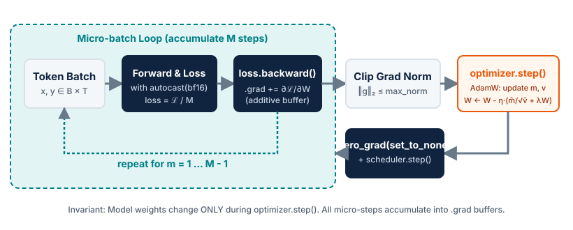

# Module 2 — Training-loop anatomy and baseline GPT

## Purpose

Understand every state change between a batch of tokens and an optimizer update,
and turn the components from Modules 1 and 2 into the first controlled language-model
experiment.

A deep learning training loop appears deceptively simple on the surface, but
getting operations in the correct order is remarkably fragile. Most mistakes in
PyTorch training loops do not throw errors or raise exceptions; instead, they
fail silently—causing runaway GPU memory consumption, stale parameter updates,
unintended gradient accumulation, or numerical divergence.

Furthermore, training a baseline language model is not merely making a loss
curve decrease: it is knowing what was trained, why the run is credible, how to
diagnose failures from curves, and which checkpoint should become the baseline
for every subsequent systems or data comparison.

This module deconstructs the training loop from first principles, grounds the
mechanics in [The Annotated PyTorch Training Loop](https://idlemachines.co.uk/essays/pytorch-training-loop),
and establishes the first end-to-end baseline run inspired by the
[GPT-2 report](https://cdn.openai.com/better-language-models/language_models_are_unsupervised_multitask_learners.pdf)
and [nanoGPT](https://github.com/karpathy/nanoGPT).

---

## Key ideas

- autograd computation graph construction and vector-Jacobian backpropagation;
- decoupled weight decay (AdamW) and parameter grouping (2D weights vs 1D biases/norms);
- gradient accumulation and exact loss normalization across micro-batches;
- global gradient norm clipping to prevent attention instability;
- warmup and cosine learning-rate schedules parameterized by optimizer steps;
- strict isolation between training and evaluation states (`model.eval()` vs `torch.no_grad()`);
- deterministic checkpointing and full optimizer state recovery (momentum buffers);
- automatic mixed precision (AMP, `bfloat16` vs `float16`) and pinned host-to-device streaming;
- the causal next-token language modeling hypothesis and parameter-count scaling;
- residual stream preservation through depth-scaled initialization ($1/\sqrt{2L}$);
- token accounting identities: tokens per update, global tokens, and wall-clock budgets;
- reading training vs validation curves, perplexity interpretation, and failure triage;
- autoregressive sampling as a qualitative diagnostic tool.

---

## The minimal training loop

The core of any PyTorch training loop consists of five sequential steps:

```python
for x, y in dataloader:
    optimizer.zero_grad(set_to_none=True)  # 1. Clear gradients
    logits, loss = model(x, targets=y)      # 2. Forward pass & loss
    loss.backward()                        # 3. Backward pass (accumulate)
    optimizer.step()                       # 4. Update model parameters
```

To understand why this sequence works—and what breaks if any line moves—we must
examine the internal state transitions:

1. **Clearing the gradient buffer (`optimizer.zero_grad(set_to_none=True)`):**
   Every trainable `torch.nn.Parameter` has a `.grad` field. PyTorch's autograd
   engine *accumulates* gradients additively into this field (`param.grad += grad`).
   Setting `set_to_none=True` deallocates the memory buffer instead of writing
   zeros over every tensor element, saving memory bandwidth and reducing peak VRAM.
2. **The forward pass (`model(x)`):**
   As input tensors pass through each operation, PyTorch constructs a Directed
   Acyclic Graph (DAG) of `torch.autograd.Node` objects. Each node records its
   inputs, intermediate tensors needed for differentiation (saved via
   `ctx.save_for_backward`), and the vector-Jacobian product function.
3. **The loss function:**
   Computes a scalar loss from model predictions and ground-truth targets. For
   causal language models, this is categorical cross-entropy:
   
   $$\mathcal{L} = -\frac{1}{N}\sum_{i=1}^{N} \log p_\theta(x_i \mid x_{<i}).$$
   
   The returned tensor is the root of the computation graph (`loss.grad_fn` points to the last node).
4. **The backward pass (`loss.backward()`):**
   Traverses the DAG backwards from `loss` to every leaf parameter. It computes
   derivatives via the chain rule and populates `.grad` on all parameters with
   `requires_grad=True`. Crucially, **`loss.backward()` does not modify weights**.
5. **The parameter update (`optimizer.step()`):**
   Reads `.grad` from every parameter and executes the optimizer update rule in place.
   **Parameters change here and nowhere else.**

<figure markdown="span">
  { loading=lazy }
  <figcaption>The anatomy of an LLM training step: micro-batch gradient accumulation, gradient norm clipping, and the AdamW update cycle.</figcaption>
</figure>

---

## Where order really matters: The silent failure catalog

The single most dangerous property of a PyTorch training loop is that
**misplaced lines rarely raise an exception**. The script executes cleanly, but the
mathematical or computational behavior is completely broken.

The table below catalogs these failure modes, grounded in the analysis from
[The Annotated PyTorch Training Loop](https://idlemachines.co.uk/essays/pytorch-training-loop):

| Operation | Wrong placement | Consequence (Silent Failure) |
| :--- | :--- | :--- |
| `model.to(device)` | **After** `optimizer = AdamW(...)` | Casting or moving a module creates new `nn.Parameter` tensors. The optimizer retains references to the discarded host parameters, updating dead memory while the active GPU model never trains. |
| `optimizer.zero_grad()` | **After** `loss.backward()` | Gradients from previous batches are not cleared; parameter updates use a growing sum of all historical batches, causing explosive divergence. |
| `clip_grad_norm_()` | **Before** `loss.backward()` | At this point, `param.grad` is `None`. The clipping function finds zero norms and executes as a silent no-op. Gradients remain unclipped. |
| `clip_grad_norm_()` | **After** `optimizer.step()` | Gradients are clipped *after* the optimizer has already applied unconstrained updates to weights. The clip is completely wasted. |
| `scheduler.step()` | **Inside** micro-batch loop | The learning rate decays once per micro-step instead of once per optimizer step, causing the learning rate to collapse orders of magnitude too early. |
| Omit `model.train()` | After running `model.eval()` | Dropout remains disabled and LayerNorm/BatchNorm tracking is frozen. The model continues training in evaluation mode without error. |
| Omit `torch.no_grad()` | During validation loop | Autograd constructs computation graphs for every evaluation batch, holding all validation activations in VRAM until an Out-Of-Memory (OOM) crash occurs. |
| Logging `loss` | Instead of `loss.item()` | Storing the tensor `loss` keeps a live reference to the entire computation graph, preventing Python garbage collection and steadily leaking memory across steps. |

---

## Layering production features

A bare 5-line loop cannot train a modern Transformer stably or efficiently.
We progressively layer on the necessary features:

### 1. Decoupled weight decay (AdamW) & parameter grouping

Standard L2 regularization adds a penalty $\frac{\lambda}{2} \|W\|_2^2$ to the loss.
For SGD, this is mathematically equivalent to weight decay. However, for adaptive
gradient optimizers like Adam, L2 regularization scales the decay by the running
gradient variance $\sqrt{v_t}$:

$$W_{t+1} = W_t - \eta \frac{g_t + \lambda W_t}{\sqrt{v_t} + \epsilon}$$

Parameters with large historical gradients receive *less* decay than parameters
with sparse gradients. Loshchilov & Hutter (2017) demonstrated that true weight
decay must be **decoupled** from the gradient update:

$$W_{t+1} = W_t - \eta \left( \frac{\hat{m}_t}{\sqrt{\hat{v}_t} + \epsilon} + \lambda W_t \right)$$

Furthermore, weight decay should **only** apply to matrix multiplications and
embedding weights. Decaying 1D tensors (such as LayerNorm/RMSNorm scale $\gamma$,
bias $\beta$, and linear biases) degrades training stability:

```python
def configure_optimizers(model, weight_decay=0.1, lr=6e-4, betas=(0.9, 0.95)):
    # Partition parameters: 2D weights get decay, 1D vectors do not
    decay_params = [p for p in model.parameters() if p.requires_grad and p.dim() >= 2]
    nodecay_params = [p for p in model.parameters() if p.requires_grad and p.dim() < 2]

    optim_groups = [
        {"params": decay_params, "weight_decay": weight_decay},
        {"params": nodecay_params, "weight_decay": 0.0},
    ]
    return torch.optim.AdamW(optim_groups, lr=lr, betas=betas)
```

### 2. Gradient accumulation

Language models require large batch sizes (e.g., $0.5\text{M}$ to $4\text{M}$ tokens)
for smooth gradient estimates and stable optimization. Because a single GPU's VRAM
can only hold a small micro-batch ($B_{\text{micro}} \times T$), we accumulate
gradients across $M$ micro-steps before updating weights:

$$\text{Tokens per update} = B_{\text{micro}} \times T \times M \times N_{\text{GPUs}}$$

Because autograd accumulates gradients additively, we must **scale the loss down by $M$**
before calling `.backward()`. Otherwise, the accumulated gradient will be $M$ times
too large:

```python
# Effective batch = grad_accum_steps * micro_batch_size
for micro in range(grad_accum_steps):
    logits, loss = model(x_micro, targets=y_micro)
    # Scale loss so the accumulated sum equals the true mean
    loss = loss / grad_accum_steps
    loss.backward()

# Update weights only once per accumulated batch
torch.nn.utils.clip_grad_norm_(model.parameters(), max_norm=1.0)
optimizer.step()
optimizer.zero_grad(set_to_none=True)
```

### 3. Gradient norm clipping

Even with AdamW and pre-norm Transformers, self-attention layers periodically
encounter anomalous batches or pathological token sequences that cause extreme
gradient spikes. If left unclipped, a single spike can push parameters into a
divergent regime from which recovery is impossible.

We compute the global $L_2$ norm of all parameter gradients combined:

$$\|g\|_2 = \sqrt{\sum_{i=1}^P \|g_i\|_2^2}$$

If $\|g\|_2 > M_{\text{clip}}$, every gradient tensor is rescaled by
$\frac{M_{\text{clip}}}{\|g\|_2 + 10^{-6}}$:

```python
# Must occur strictly AFTER backward() and BEFORE optimizer.step()
total_norm = torch.nn.utils.clip_grad_norm_(model.parameters(), max_norm=1.0)
```

Tracking `total_norm` over time is a primary diagnostic for training health: a
healthy run maintains a stable norm ($0.1 \le \|g\|_2 \le 1.5$), whereas frequent
clipping saturation indicates learning rate instability.

### 4. Learning-rate schedules: Warmup and cosine decay

Randomly initialized attention layers produce nearly uniform attention distributions,
generating noisy gradients that would corrupt initial embeddings under a large
initial learning rate.

A standard LLM schedule incorporates two phases:

1. **Linear warmup:** Linearly increases the learning rate from $0$ to $\eta_{\text{max}}$
   over $T_{\text{warmup}}$ steps.
2. **Cosine decay:** Anneals the learning rate from $\eta_{\text{max}}$ down to
   $\eta_{\text{min}} \approx 0.1 \times \eta_{\text{max}}$ over the remaining steps:

$$\eta_t = \begin{cases}
\eta_{\text{max}} \cdot \frac{t + 1}{T_{\text{warmup}} + 1}, & t < T_{\text{warmup}} \\
\eta_{\text{min}} + \frac{1}{2} \left(1 + \cos\left(\pi \frac{t - T_{\text{warmup}}}{T_{\text{max}} - T_{\text{warmup}}}\right)\right) (\eta_{\text{max}} - \eta_{\text{min}}), & T_{\text{warmup}} \le t \le T_{\text{max}} \\
\eta_{\text{min}}, & t > T_{\text{max}}
\end{cases}$$

```python
def get_lr_cosine_schedule(step, warmup_steps, max_steps, max_lr, min_lr=0.0):
    if step < warmup_steps:
        return max_lr * (step + 1) / (warmup_steps + 1)
    if step > max_steps:
        return min_lr
    decay_ratio = (step - warmup_steps) / (max_steps - warmup_steps)
    coeff = 0.5 * (1.0 + math.cos(math.pi * decay_ratio))
    return min_lr + coeff * (max_lr - min_lr)
```

In LLM pretraining, schedules are parameterized by **global optimizer steps**, not
epochs, because datasets consist of billions of non-repeating tokens.

### 5. Evaluation protocol and memory isolation

Validation monitors cross-entropy loss and Perplexity ($\mathrm{PPL} = \exp(\mathcal{L})$)
on unseen tokens. Two distinct mechanisms must be used together during evaluation:

```python
@torch.no_grad()
def evaluate_loss(model, dataset, eval_iters=20):
    model.eval()  # 1. Disable dropout, freeze batch stats
    losses = []
    for _ in range(eval_iters):
        x, y = dataset.get_batch()
        _, loss = model(x, targets=y)
        losses.append(loss.item())  # 2. Extract float to prevent memory leak
    model.train()  # 3. Restore training mode!
    return sum(losses) / len(losses)
```

Notice the three critical invariants:
- `model.eval()` toggles module behavior (e.g. disables dropout); it does **not** stop autograd.
- `torch.no_grad()` disables gradient tracking and memory allocation for the DAG; it does **not** change module behavior.
- `model.train()` must be restored immediately after the evaluation loop finishes.

### 6. Checkpointing and exact recovery invariants

A production training run must be preemptible. A valid checkpoint must capture
the entire state required to reproduce the exact subsequent trajectory:

```python
def save_checkpoint(path, model, optimizer, config, step, val_loss):
    raw_model = model.module if hasattr(model, "module") else model
    state = {
        "model": raw_model.state_dict(),
        "optimizer": optimizer.state_dict(),  # First and second moments!
        "config": config,
        "step": step,
        "val_loss": val_loss,
    }
    torch.save(state, path)
```

If `optimizer.state_dict()` is omitted, the momentum buffers ($m_t$ and $v_t$)
are lost. Upon resuming, the optimizer starts cold with zero momentum, causing
a sudden loss spike.

### 7. Automatic Mixed Precision (AMP) & GPU efficiency

Modern GPUs deliver several times higher compute throughput when executing matrix
multiplications in half-precision (`bfloat16` or `float16`) instead of `float32`.

- **`bfloat16` (Preferred for LLMs):** Possesses the exact same 8-bit dynamic exponent
  range as `float32`. Gradients do not underflow, so no gradient scaling is needed.
- **`float16` (Legacy/Inference):** Has a 5-bit exponent range. Small gradients
  underflow to zero unless multiplied by a dynamic scale factor via `GradScaler`.

When using `GradScaler`, the order of operations between unscaling and clipping
is critical:

```python
scaler = torch.amp.GradScaler("cuda", enabled=(dtype == torch.float16))

# Inside micro-step:
with torch.amp.autocast(device_type="cuda", dtype=dtype):
    logits, loss = model(x, targets=y)
    loss = loss / grad_accum_steps
scaler.scale(loss).backward()

# At optimizer step boundary:
# Must UNSCALE gradients BEFORE clipping, otherwise the norm is scaled!
scaler.unscale_(optimizer)
torch.nn.utils.clip_grad_norm_(model.parameters(), max_norm=1.0)
scaler.step(optimizer)
scaler.update()
optimizer.zero_grad(set_to_none=True)
```

Furthermore, data transfers between Host (CPU) and Device (GPU) can overlap with
compute if the source tensor is allocated in page-locked pinned memory:

```python
# Non-blocking transfer overlaps CUDA copy engine with tensor cores
x = x.to(device, non_blocking=True)
y = y.to(device, non_blocking=True)
```

---

## The GPT baseline: Architecture and parameter scaling

The [GPT-2 report](https://cdn.openai.com/better-language-models/language_models_are_unsupervised_multitask_learners.pdf)
established causal language modeling as an unsupervised multitask learner. The key
architectural recipe consists of:

- decoder-only causal self-attention;
- learned token and absolute position embeddings;
- pre-normalization: LayerNorm before attention and before the MLP;
- an additional final LayerNorm before the LM head;
- an MLP with an expansion ratio of four (hidden dimension $4d$);
- tied token-embedding and output-head weights;
- residual projections initialized more conservatively as depth increases;
- a language-model head that produces one logit per vocabulary item.

### Reading configuration as a parameter count

Let:
- $L$ be the number of Transformer blocks;
- $d$ the model width (hidden dimension);
- $h$ the number of attention heads;
- $d_h = d/h$ the head width;
- $V$ the vocabulary size;
- $T$ the maximum context length.

Ignoring biases and normalization vectors, one GPT block contains:

| Component | Approximate parameters |
| :--- | :--- |
| Q, K, and V projections | $3d^2$ |
| Attention output projection | $d^2$ |
| MLP expansion ($d \to 4d$) | $4d^2$ |
| MLP contraction ($4d \to d$) | $4d^2$ |
| **Total per block** | **$12d^2$** |

With tied input/output embeddings, the total parameter count is:

$$N \approx 12Ld^2 + Vd + Td.$$

The $12Ld^2$ term dominates as depth and width grow. For $L=12, d=768, V=50{,}257, T=1024$ (GPT-2 124M):
- Transformer blocks: $12 \times 12 \times 768^2 \approx 84.9\text{M}$ parameters;
- Token embeddings: $50{,}257 \times 768 \approx 38.6\text{M}$;
- Position embeddings: $1024 \times 768 \approx 0.8\text{M}$.
- Total: $\approx 124\text{M}$ parameters.

---

## Initialization: Preserve the residual stream

Standard linear layers are initialized with standard deviation $\sigma = 0.02$.
However, each Transformer block adds two branches to the residual stream:
attention and MLP:

$$x_{l+1} = x_l + \text{Attn}(\text{LN}(x_l)) + \text{MLP}(\text{LN}(x_l)).$$

As depth $L$ increases, the variance of the residual stream accumulates linearly:
$\text{Var}(x_L) \approx 2L \cdot \text{Var}(x_0)$. To preserve activations and prevent
gradient explosion across deep models, residual output projections (`c_proj` in attention
and MLP) are initialized with scaled variance:

$$\sigma_{\text{resid}} = \frac{0.02}{\sqrt{2L}}.$$

### Pre-flight sanity checks

Before committing to an expensive training run:
1. **Initial loss check:** For random initialization, initial loss should be close to uniform next-token prediction:
   
   $$\mathcal{L}_{\text{init}} \approx \log(V).$$
   
   For $V=50{,}257$, $\log(50{,}257) \approx 10.82$ nats.
2. **Gradient check:** Verify that `param.grad` is finite, non-zero, and within $[0.01, 10.0]$ after the first backward pass.
3. **Tiny-batch overfit:** The model must be able to drive loss on a single batch ($B=4, T=32$) down to $< 0.1$ within 50 steps.

---

## Specifying the experiment & token accounting

A reproducible run is specified completely by its configuration tuple:

$$\text{run} = (\text{code}, \text{data}, \text{tokenizer}, \text{model}, \text{optimizer}, \text{schedule}, \text{seed}, \text{hardware}).$$

The fundamental accounting identity connects micro-batches to global tokens:

$$\text{Tokens per update} = B_{\text{micro}} \times T \times A \times D,$$

where $A$ is gradient-accumulation steps and $D$ is data-parallel replicas ($D=1$ on a single GPU).

Total training volume is defined strictly in tokens:

$$\text{Total tokens} = \text{Tokens per update} \times \text{Optimizer updates}.$$

Always compare runs at the **same number of training tokens**, not simply the same number of loop iterations.

---

## Reading curves as evidence: Failure triage

Training loss answers: *is the optimizer fitting the batches it sees?*  
Validation loss answers: *does that improvement transfer to held-out tokens?*

| Observation | Plausible interpretation | Next check |
| :--- | :--- | :--- |
| Train and validation loss both fall | Healthy learning | Verify token accounting and sample coherence |
| Train falls; validation flattens or rises | Overfitting or split mismatch | Inspect split, deduplication, and weight decay |
| Both remain near $\log V$ | Model not learning or target alignment bug | Verify tiny-batch overfit, learning rate, and target shift ($y = x[1:]$) |
| Sudden loss spike with gradient norm spike | Unstable update, batch outlier, or LR too high | Check gradient norms, clipping, learning rate, and numerical range |
| Smooth curve but incoherent samples | Sampling bug, bad prompt, or undertraining | Check prompt tokenization, temperature, and top-$p$ logic |
| Validation improves implausibly fast | Train-val data leakage or duplicates | Audit document-level splits and cross-split n-gram overlap |
| Loss spikes immediately after resume | Incomplete checkpoint state | Verify optimizer moments ($m_t, v_t$) and scheduler were restored |

---

## Sampling is a diagnostic, not a score

Sampling catches errors that a scalar loss can hide: broken causal masks,
inconsistent tokenizer artifacts, forgotten evaluation mode, pathological
repetition, or corrupted decoding loops.

Maintain a fixed evaluation prompt suite:
- an empty or `<|endoftext|>` beginning-of-sequence prompt;
- a short in-domain passage prefix;
- a held-out validation prefix;
- an out-of-domain prompt to test distribution boundaries.

Generate with two distinct settings:
1. **Low temperature ($T = 0.1$–$0.2$):** Exposes the greedy, high-probability backbone.
2. **Moderate temperature ($T = 0.8$, top-$p = 0.9$):** Inspects vocabulary diversity and sample fluency.

Never select a checkpoint because one single sample looks charming. Select strictly by the validation loss protocol, and use samples to diagnose qualitative behavior.

---

## Practical task

1. **Parameter grouping:** Implement `configure_optimizers` and verify that 2D weight matrices receive weight decay while 1D biases and normalization vectors receive $0.0$.
2. **Complete step execution:** Build the step function combining gradient accumulation, AMP autocasting, unscaling, gradient norm clipping, and the cosine schedule.
3. **Tiny-batch overfit:** Initialize a small version of the Session 1 model and drive the loss on one fixed, shifted token batch below $0.1$.
4. **Checkpoint round-trip:** Save the overfit model and optimizer, restore both into fresh objects, and verify identical logits on the fixed input.
5. **Optional baseline run:** Move beyond the diagnostic batch to a small corpus, logging train loss, validation loss, learning rate, gradient norm, and fixed-prompt samples.

---

## Expected output

A reproducible local overfit checkpoint with:
- exact parameter partitioning between decayed and non-decayed groups;
- final loss below $0.1$ on the fixed shifted batch;
- stable gradient norms under accumulation;
- an exact model-and-optimizer restore producing identical logits.

The longer baseline run and qualitative sampling remain an optional extension;
they are not required to establish that the Session 2 training path works.

---

## References

- [The Annotated PyTorch Training Loop (idlemachines.co.uk)](https://idlemachines.co.uk/essays/pytorch-training-loop)
  — comprehensive line-by-line deconstruction of the training loop and placement hazards;
- [Loshchilov & Hutter (2017) — Decoupled Weight Decay Regularization](https://arxiv.org/abs/1711.05101)
  — introduces the AdamW formulation;
- [Language Models are Unsupervised Multitask Learners](https://cdn.openai.com/better-language-models/language_models_are_unsupervised_multitask_learners.pdf)
  — the GPT-2 report: motivation, architecture, and zero-shot transfer;
- [nanoGPT (Andrej Karpathy)](https://github.com/karpathy/nanoGPT)
  — minimal, readable GPT model and training harness.

---

[:material-file-pdf-box: View Lecture Slides (PDF)](../slides/02-training-loop.pdf){ .md-button target="_blank" }
[:material-code-tags: Practical Companion Guide](../companion/02-training-loop.md){ .md-button .md-button--primary }
