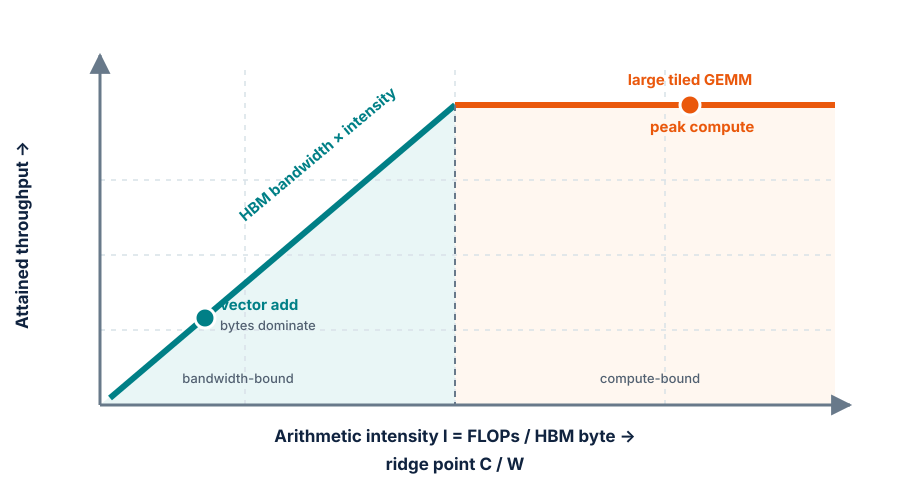

# Module 6 — Single-GPU performance

## Purpose

Build a hardware model of one GPU, then use it to predict and explain the
performance of the course training step. Optimization begins with a bottleneck
hypothesis, not a bag of flags.

The main reference is the Scaling Book chapter
[How to Think About GPUs](https://jax-ml.github.io/scaling-book/gpus/). Its
hardware numbers are examples, not universal constants: always pair a formula
with the specification of the GPU actually used.

## Learning goals

By the end of the module, students should be able to:

- distinguish CUDA cores, Tensor Cores, SMs and GPU memory levels;
- explain warps, occupancy, divergence and memory coalescing at a useful level;
- calculate arithmetic intensity and place an operation on a roofline;
- decompose training memory into persistent state, activations and temporary
  workspaces;
- read a profiler trace as a timeline of CPU launch, GPU kernels and transfers;
- choose an optimization that targets the measured bottleneck;
- report throughput, memory and numerical behavior without changing the task.

## A GPU is not one fast processor

A modern NVIDIA training GPU contains many **streaming multiprocessors** (SMs).
Each SM combines:

- **Tensor Cores** specialized for dense low-precision matrix multiplication;
- **CUDA cores** for flexible scalar/vector arithmetic and reductions;
- warp schedulers that issue instructions to groups of 32 threads;
- registers and shared memory/L1 close to the compute units.

The full device also has a shared L2 cache and high-bandwidth memory (HBM).
Calling all of these pieces “GPU compute” hides the questions that matter:

- Is the kernel feeding Tensor Cores with supported shapes and precision?
- Are enough independent warps resident to hide memory latency?
- Are threads reading adjacent memory locations?
- Does the working set remain on chip or repeatedly travel to HBM?
- Are many tiny kernels dominated by launch overhead?

## From thread to warp to SM

CUDA exposes a hierarchy:

```text
grid
  └── thread blocks
        └── warps of 32 threads
              └── individual threads
```

Threads in a warp follow a SIMT model: they normally execute the same
instruction on different data. If a branch sends some threads down one path and
the rest down another, the warp executes both paths with inactive lanes masked.
This **warp divergence** lowers useful work per issued instruction.

An SM keeps several warps resident and switches among ready warps when another
is waiting for data. More resident warps can hide latency, but occupancy is
limited by registers, shared memory and the maximum blocks/warps supported by
the SM. Maximum occupancy is not a goal by itself: a kernel using more registers
may do less memory traffic and run faster despite lower occupancy.

### Why shapes matter

Tensor Cores operate on tiles. Matrix dimensions, dtype, alignment and layout
determine whether an implementation can use efficient kernels. Padding a
vocabulary or hidden dimension to a friendly multiple can make a mathematically
larger operation faster.

This is why nanoGPT uses a padded vocabulary size for from-scratch training and
why benchmark results must report shapes, not just parameter counts.

## The memory hierarchy

Memory becomes larger and slower as it moves away from the execution units:

| Level | Scope | Typical role | Optimization question |
| --- | --- | --- | --- |
| Registers | one thread | scalars, accumulators | are spills occurring? |
| Shared memory / L1 | one SM/block | reused tiles | is reuse worth the limited capacity? |
| L2 | whole GPU | shared cache | is the access pattern cache-friendly? |
| HBM | whole GPU | weights, states, activations | are bytes dominating runtime? |
| Host memory | CPU | dataset, offloaded state | are transfers on the critical path? |

For an H100 example in the Scaling Book, HBM bandwidth is about 3.35 TB/s while
peak BF16 Tensor Core throughput is about 990 TFLOP/s. The ratio is the key:
the device can perform hundreds of floating-point operations in the time needed
to stream one byte from HBM.

This imbalance explains why recomputing a value can be faster than storing and
reloading it, and why kernel fusion can help even when it does not reduce FLOPs.

## Roofline reasoning

For an operation:

\[
I = \frac{\text{FLOPs}}{\text{bytes transferred}}
\]

is its arithmetic intensity. Let \(C\) be peak compute throughput and \(W\)
memory bandwidth. The roofline bound is

\[
P_{\max} = \min(C, I W),
\]

or equivalently

\[
t \ge \max\left(
\frac{\text{FLOPs}}{C},
\frac{\text{bytes}}{W}
\right).
\]

The **ridge point** is \(C/W\). Below it, the operation is bandwidth-bound;
above it, it can be compute-bound.

<figure markdown="span">
  { loading=lazy }
  <figcaption>The roofline is a prediction: place an operation by arithmetic intensity, then look for the lower ceiling.</figcaption>
</figure>

### Worked example 1 — vector addition

Adding two FP32 vectors and writing the result performs one FLOP while moving
approximately 12 bytes per element: two 4-byte reads and one 4-byte write.

\[
I_{\text{add}} \approx \frac{1}{12}\ \text{FLOP/byte}.
\]

No amount of Tensor Core peak throughput changes this low intensity. Improve
the memory path or fuse the addition into a neighboring operation so the
intermediate is never written to HBM.

### Worked example 2 — matrix multiplication

For \(A\in\mathbb{R}^{M\times K}\) and
\(B\in\mathbb{R}^{K\times N}\), the product performs approximately
\(2MKN\) FLOPs. A simple BF16 byte estimate is

\[
2(MK + KN + MN)\ \text{bytes}.
\]

Larger matrices reuse each loaded element many times, raising arithmetic
intensity. Small batch or token dimensions can leave the same linear layer
bandwidth- or latency-bound even though its large-batch form is compute-bound.

## Training memory: what occupies VRAM?

Peak allocated memory is not just model weights:

\[
M_{\text{peak}} = M_{\text{params}} + M_{\text{grads}} + M_{\text{optimizer}}
+ M_{\text{activations}} + M_{\text{temporary}} + M_{\text{allocator}}.
\]

For \(N\) parameters, a common AdamW mixed-precision budget is approximately:

| State | Example dtype | Bytes/parameter |
| --- | --- | ---: |
| forward parameters | BF16 | 2 |
| gradients | BF16 or FP32 | 2 or 4 |
| FP32 master parameters | FP32 | 4 |
| first moment | FP32 | 4 |
| second moment | FP32 | 4 |

The exact implementation may omit the master copy, accumulate gradients in a
different dtype, or fuse optimizer state. Inspect the real optimizer rather
than treating “16 bytes per parameter” as a law.

Activation memory depends on batch size, sequence length, width, layer count,
attention implementation and what backward needs to save. It is the component
most affected by:

- gradient accumulation, which reduces the resident micro-batch;
- activation checkpointing, which trades recomputation for storage;
- FlashAttention/SDPA, which avoids materializing the full attention matrix;
- compilation and fusion, which can eliminate intermediates;
- sequence length, which can make naive attention storage grow quadratically.

Measure both **allocated** and **reserved** memory. Framework allocators keep
segments reserved for reuse, so an apparent gap is not necessarily a leak.

## FLOPs, tokens/s, MFU and time-to-train

For a dense decoder-only Transformer away from extreme context lengths, a
widely used first-order estimate for training compute is

\[
\text{training FLOPs} \approx 6NT,
\]

where \(N\) is non-embedding parameters and \(T\) training tokens. Attention
adds a sequence-length-dependent term that should not be ignored for long
contexts.

Useful metrics answer different questions:

| Metric | What it answers |
| --- | --- |
| tokens/s | how fast does this exact workload progress? |
| step time | where did latency change? |
| peak memory | what larger workload might fit? |
| achieved FLOP/s | how much arithmetic ran per second? |
| MFU | what fraction of theoretical peak performed model-required FLOPs? |
| HFU | what fraction included recomputation and other hardware work? |
| time-to-target | did the end-to-end experiment improve? |

An optimization can raise hardware utilization while slowing time-to-target,
for example by adding unnecessary recomputation. Tokens/s and validation
behavior remain the primary outcomes for this course.

## Read a profiler trace as a causal story

Profile after warmup, over multiple representative steps, with the same batch
and synchronization points used in the benchmark.

Look for:

1. **CPU gaps:** the GPU waits because data loading or Python launch is late;
2. **many tiny kernels:** launch overhead or unfused pointwise work dominates;
3. **large GEMMs with low utilization:** shapes or precision miss an efficient
   kernel path;
4. **explicit device copies:** input transfer or accidental host round trips;
5. **attention matrix kernels:** a non-fused attention path may materialize
   \(T\times T\) scores;
6. **allocator churn:** repeated allocation or shape changes prevent reuse;
7. **synchronization:** logging `.item()`, timing without CUDA events, or memory
   queries can serialize asynchronous work.

Use top-down questions:

- Is the GPU busy?
- If busy, is it doing useful kernels?
- If useful, are those kernels compute-, bandwidth- or latency-bound?
- Which source operation launched the dominant kernel?

## Optimization ladder

Change one mechanism at a time and re-measure correctness, throughput and
memory.

### 1. Input pipeline

- prefetch and use pinned host memory when transfers warrant it;
- avoid tokenization or decompression on the critical path;
- check that batches are ready before the GPU asks for them.

### 2. Precision

BF16 halves parameter and activation bytes relative to FP32 and enables fast
Tensor Core paths while retaining FP32-like exponent range. FP16 may need loss
scaling. Precision changes require a loss/gradient comparison, not only a speed
measurement.

### 3. Scaled-dot-product attention

Efficient SDPA/FlashAttention tiles Q, K and V through on-chip memory and avoids
writing the full attention matrix to HBM. It is exact attention with a different
IO schedule, not sparse or approximate attention.

### 4. Fused operations

Fusion combines operations so intermediates stay in registers or shared memory.
Typical opportunities include bias plus activation, normalization, optimizer
updates and the cross-entropy path.

### 5. Compilation

Compilation can fuse graphs, specialize shapes and reduce Python/kernel-launch
overhead. Separate compile time from steady-state time, and watch for graph
breaks or recompilation caused by changing shapes.

### 6. Activation checkpointing

Checkpointing saves memory by discarding selected activations and recomputing
them during backward. It is valuable only if the released memory enables a
better micro-batch or prevents an OOM at acceptable time cost.

## Benchmark protocol

For every variant:

1. use the same model, batch tensors, precision target and optimizer semantics;
2. warm up until compilation and caches stabilize;
3. time enough steps to report a distribution, not one value;
4. synchronize correctly around timing boundaries;
5. record median step time, tokens/s and peak allocated/reserved memory;
6. compare loss and gradients on a fixed batch within declared tolerances;
7. save the profiler trace supporting the bottleneck explanation.

Report environment details: GPU model, driver/runtime, framework version,
power mode and whether other processes shared the device.

## In-class investigation

### Part A — roofline worksheet

For vector addition, LayerNorm and one course-model matrix multiplication:

1. estimate FLOPs and HBM bytes;
2. compute arithmetic intensity;
3. find the target GPU's \(C/W\) ridge point;
4. predict the bound;
5. name one optimization consistent with that prediction.

### Part B — memory prediction

Before running, estimate persistent model-state memory and activation growth as
micro-batch and sequence length change. Then compare with measured allocated
and reserved peaks. Explain the largest discrepancy.

### Part C — one-change ablation

Start with eager FP32 or the declared baseline. Add one of BF16, SDPA,
compilation or checkpointing. Produce a table with:

| Variant | tokens/s | median step ms | peak allocated | peak reserved | loss delta |
| --- | ---: | ---: | ---: | ---: | ---: |

The conclusion must name the bottleneck the change targeted and whether the
trace supports the explanation.

## Exit ticket

1. Why can a GPU with enormous peak TFLOP/s still be slow on vector addition?
2. What is the difference between bandwidth-bound and latency-bound?
3. Why can lower occupancy still produce a faster kernel?
4. How can fusion improve runtime without reducing mathematical FLOPs?
5. Why is peak reserved memory different from live tensor memory?

## Expected output

A measurement-first performance report containing a hardware-aware prediction,
a memory budget, baseline trace, one-change ablations and a justified final
single-GPU configuration.

## References

- [How to Think About GPUs](https://jax-ml.github.io/scaling-book/gpus/)
  — primary conceptual spine for GPU execution, memory and rooflines;
- [PyTorch profiler recipe](https://docs.pytorch.org/tutorials/recipes/recipes/profiler_recipe.html)
  — trace collection and interpretation;
- [PyTorch performance tuning guide](https://docs.pytorch.org/tutorials/recipes/recipes/tuning_guide.html)
  — practical tuning mechanisms;
- [FlashAttention](https://arxiv.org/abs/2205.14135)
  — IO-aware exact attention and tiling analysis.

---

[:material-file-pdf-box: View Lecture Slides (PDF)](../slides/06-single-gpu.pdf){ .md-button target="_blank" }
[:material-code-tags: Practical Companion Guide](../companion/06-single-gpu.md){ .md-button .md-button--primary }

