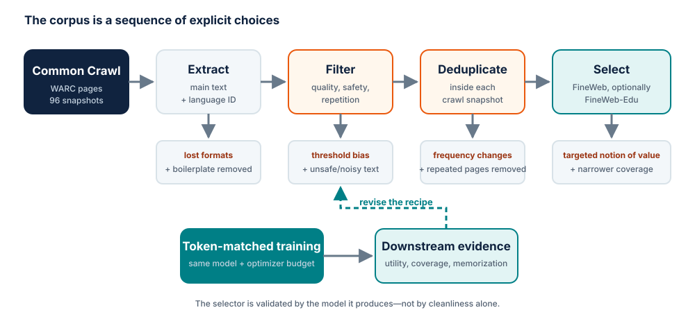

# Module 5 — Data selection through the FineWeb case study

## Purpose

Ask which documents deserve a limited training budget, then learn how to test a
data-curation claim without confusing corpus size, data quality and benchmark
noise.

[The FineWeb Datasets](https://arxiv.org/abs/2406.17557) and its
[long-form technical report](https://huggingface.co/spaces/HuggingFaceFW/blogpost-fineweb-v1)
are the main case study. FineWeb matters pedagogically because the authors
publish the pipeline, ablation models, evaluation results and several ideas
that did *not* work. It turns “clean the web” into a sequence of testable
decisions.

## Learning goals

By the end of the module, students should be able to:

- treat dataset construction as an empirical modeling problem;
- distinguish extraction, filtering, deduplication, selection and mixing;
- explain what MinHash approximates and what it cannot detect;
- design a fixed-token comparison between two dataset variants;
- recognize when a filter improves one target while erasing useful diversity;
- audit contamination, leakage and provenance before claiming improvement.

## “Quality” is an operational claim

A document is not universally high quality. It can be useful for one model,
budget or target distribution and harmful for another. In this course, a data
quality claim must be written as:

> Under a fixed model, tokenizer, optimizer, token budget and evaluation
> protocol, training on dataset variant A changes metric M relative to variant B.

This definition deliberately separates three questions:

1. **Intrinsic inspection:** does the text look readable, complete and safe?
2. **Distributional analysis:** what languages, domains, styles and duplicate
   clusters are present or removed?
3. **Downstream utility:** does a model trained on it perform better under a
   controlled budget?

Human inspection is essential for understanding failures, but model training
is the final test of a pretraining-data intervention. A tidy-looking corpus can
still remove rare knowledge, informal language or formats needed downstream.

## FineWeb at a glance

FineWeb contains 15 trillion GPT-2 tokens derived from 96 Common Crawl
snapshots. Its recipe is a pipeline rather than one quality score.

<figure markdown="span">
  { loading=lazy }
  <figcaption>Every stage removes data and changes the distribution. Controlled training closes the evaluation loop.</figcaption>
</figure>

The final order matters. Each stage changes the distribution seen by the next
stage, and a threshold that behaves well before deduplication may behave
differently afterwards.

## Step 1 — extraction is already selection

Common Crawl provides raw WARC records containing HTML and metadata, as well as
WET text extracted by a generic pipeline. FineWeb starts from WARC and uses
`trafilatura` with a precision-favoring configuration.

In the reported ablation on one crawl, the WET-derived corpus retained roughly
25% more tokens but trained a worse model than text extracted from WARC with
`trafilatura`. The additional data contained more navigation and boilerplate.

The lesson is broader than one library:

- extraction defines which DOM regions become training text;
- “more tokens” can mean “more repeated chrome,” not more information;
- extraction quality and filtering quality are coupled;
- raw bytes, extracted text and trainable documents should have separate
  versioned artifacts.

### Inspection prompt

Compare the raw HTML, WET text and extracted main text for five pages. Annotate
what was lost, what boilerplate remained, and whether the document boundary
still makes sense. Do not reduce the audit to a single cleanliness score.

## Step 2 — base filtering

FineWeb's base stage applies:

- URL blocklist filtering for adult content;
- a fastText English-language score threshold of 0.65;
- quality and repetition rules adapted from MassiveText.

After this stage, the 96 crawls contain roughly 36 trillion GPT-2 tokens.

Every rule creates false positives and false negatives. A language classifier,
for example, can disproportionately remove code-switching, names, dialects and
short documents. A safety blocklist can remove legitimate health or educational
material along with unwanted content. Record removal rates by source and group,
not only globally.

## Step 3 — deduplication

The web contains mirrors, syndicated articles, templates, crawl artifacts and
pages reachable through many URLs. Training repeatedly on them wastes a finite
token budget and can increase memorization.

### Exact, fuzzy and semantic duplicates

| Method | Detects | Misses or risks |
| --- | --- | --- |
| Exact hash | byte-identical text | formatting and small edits |
| URL normalization | repeated canonical URLs | mirrors and changed URLs; same URL over time |
| Line/paragraph hash | repeated boilerplate | context; can fragment documents |
| MinHash over n-grams | near-duplicate surface text | paraphrases and semantic equivalence |
| Embedding similarity | semantic proximity | expensive; may erase legitimately related texts |

FineWeb uses 5-word shingles and 112 MinHash functions arranged as 14 bands of
8 hashes, targeting documents around 75% Jaccard similarity. For similarity
\(s\), the probability that at least one band matches is

\[
P(\text{candidate match}) = 1 - (1 - s^8)^{14}.
\]

This is a probabilistic candidate rule, not a magical definition of duplicate.
Students should plot it for \(s \in [0,1]\) and mark where false positives and
false negatives are most likely.

### The surprising FineWeb result

The first approach deduplicated newer and older crawls together. Older crawls
lost more than 90% of their data because matches in later crawls were already
kept. The resulting 4T-token corpus did not improve the authors' 350B-token
ablation as expected.

On an old crawl, data retained by this global process was visibly worse than a
large portion of the removed data. One hypothesis is that recurring duplicates
can be a weak quality signal: useful pages are copied, cited and preserved,
while unique pages are not automatically valuable. FineWeb therefore performs
MinHash deduplication independently within each crawl.

!!! warning "Do not turn this into a universal rule"
    “Global deduplication is bad” is not the result. The result depends on the
    crawl structure, retention rule, sampling budget and evaluation scale.
    Large duplicate clusters, benchmark leakage and memorization still matter.

The case study also shows why small ablations can miss deduplication effects.
If duplicates are sparse in a huge source, a small uniform sample may contain
almost no repeated pair even when the full corpus is highly redundant.

## Step 4 — heuristic filtering as hypothesis testing

FineWeb tested C4-style rules individually. A strict terminal-punctuation rule
gave a large improvement but removed roughly 30% of tokens. A group of less
destructive rules performed better while removing much less, so the final
recipe excluded the strict punctuation rule.

The authors then built custom filters with a repeatable process:

1. compute many document statistics on higher- and lower-quality corpora;
2. find statistics whose distributions differ substantially;
3. inspect the distributions and removed examples;
4. choose candidate thresholds;
5. train ablation models to validate each rule.

Three retained rules remove documents with:

- at most 12% of lines ending in punctuation;
- at least 10% of characters occurring in duplicated lines;
- at least 67% of lines shorter than 30 characters.

Together they removed about 22% of tokens in the tested slice. The numbers are
not commandments for another corpus. The transferable idea is the loop from
statistic, to examples, to threshold, to controlled training evidence.

## Step 5 — learned educational selection

FineWeb-Edu illustrates a learned quality pipeline:

1. sample documents from FineWeb;
2. ask Llama-3-70B-Instruct to assign an educational score from 0 to 5;
3. train a smaller classifier on 450,000 of those annotations;
4. validate on a held-out annotated set;
5. score the full corpus and select by threshold;
6. train models on selected data to evaluate the intervention.

A threshold of 3 retains 1.3T tokens and strongly improves knowledge- and
reasoning-oriented evaluations in the reported setting. A threshold of 2
retains 5.4T tokens. The stricter threshold is not better on every benchmark:
selection changes the domain mixture as well as the average score.

This is a form of model-mediated curation. Its risks include:

- inheriting the annotator model's preferences and blind spots;
- mistaking one style of explanation for educational value;
- narrowing language, culture or document-format diversity;
- training the student distribution toward the teacher model's worldview;
- overstating classifier validation when the labels are themselves synthetic.

## Design a fair data ablation

The FineWeb ablations keep model architecture, hyperparameters and number of
sampled training tokens fixed. The course experiment should follow the same
logic.

### Experimental contract

| Variable | Must be fixed or reported? |
| --- | --- |
| model initialization and seed | fixed |
| tokenizer and sequence packing | fixed |
| optimizer and LR schedule | fixed |
| number of optimizer updates | fixed |
| tokens per update | fixed |
| total sampled tokens | fixed |
| evaluation checkpoints | fixed |
| evaluation suite and prompts | fixed |
| dataset variant | **changed intentionally** |

If filtering leaves fewer unique tokens than the budget, declare whether data
is repeated. Comparing one epoch of a small selected corpus with a fraction of
a larger random corpus changes both repetition and selection.

### Minimum baselines

1. **Uniform random:** establishes what the unselected source can do.
2. **Simple heuristic:** uses an interpretable signal such as length,
   language confidence or repetition.
3. **Deduplicated:** isolates the value of removing surface redundancy.
4. **Proposed selector:** changes one clearly defined mechanism.

Mixtures should be compared at matched token counts with explicit sampling
weights. A 60/40 mixture describes expected sampled tokens, not necessarily
stored corpus sizes.

## Evaluate the selector before and after training

### Before training

Report:

- documents and tokens kept and removed;
- score distribution and threshold sensitivity;
- removal rate by source, time, language and domain;
- exact and near-duplicate rates;
- random examples near the threshold;
- examples of obvious false positives and false negatives;
- overlap with validation and benchmark text.

### After training

Report:

- validation loss on a fixed general corpus;
- at least one in-domain and one out-of-domain evaluation;
- learning curves, not only final values;
- uncertainty across seeds or data samples when affordable;
- performance per training token and per unit of compute;
- regressions, not only aggregate gains.

A single average benchmark score can hide a distribution trade-off. Show the
individual task results before presenting an aggregate.

## Contamination and split integrity

Deduplicate *before* finalizing document-level train/validation membership, or
explicitly deduplicate across the split boundary. Token-window random splits
can place adjacent spans from one document in both sets.

For benchmark decontamination, define:

- the matching unit: token n-gram, character span, document or semantic match;
- normalization rules;
- the threshold;
- which side is removed;
- how much data is affected.

No detector proves the absence of contamination. The audit provides evidence
under a declared matching rule.

## In-class investigation

### Part A — reverse-engineer one rule

Choose one FineWeb filter. For ten kept and ten removed examples:

1. explain what artifact the rule targets;
2. find a plausible false positive;
3. find a plausible false negative;
4. predict which domains it changes most;
5. propose one measurement before changing its threshold.

### Part B — MinHash on paper

For two short documents:

1. construct their word 5-gram sets;
2. calculate Jaccard similarity;
3. use \(1-(1-s^8)^{14}\) to estimate candidate probability;
4. explain why near-duplicate detection is probabilistic;
5. decide whether the documents should share a cluster and defend the policy.

### Part C — pre-register the course comparison

Write the selection hypothesis, fixed variables, primary metric and stopping
rule before training. Also state one result that would falsify the hypothesis.

## Exit ticket

1. Why can better text extraction outperform a larger extracted corpus?
2. Why did independent-per-crawl deduplication beat the tested global strategy?
3. What information is lost when all selector quality is reduced to one score?
4. Why must a selected and random corpus contain the same number of sampled
   training tokens?
5. How can a filter improve MMLU while harming a different target?

## Expected output

A versioned selected corpus, a data card describing what was retained and
removed, and a pre-registered fixed-token experiment comparing it with random,
heuristic and deduplicated baselines.

## References and related resources

- [The FineWeb Datasets](https://arxiv.org/abs/2406.17557)
  — paper describing the 15T-token dataset, ablations and FineWeb-Edu;
- [FineWeb long-form technical report](https://huggingface.co/spaces/HuggingFaceFW/blogpost-fineweb-v1)
  — detailed pipeline, failed experiments and interactive figures;
- [FineWeb dataset card](https://huggingface.co/datasets/HuggingFaceFW/fineweb)
  — schema, versions, subsets and release notes;
- [DataTrove](https://github.com/huggingface/datatrove)
  — the processing library and reproducible FineWeb pipeline;
- [FineWeb dataset-comparison models](https://huggingface.co/collections/HuggingFaceFW/dataset-comparison-models)
  — checkpoints for inspecting the evidence behind pipeline decisions;
- [DataComp-LM](https://arxiv.org/abs/2406.11794)
  — a complementary benchmark for controlled dataset experiments.
