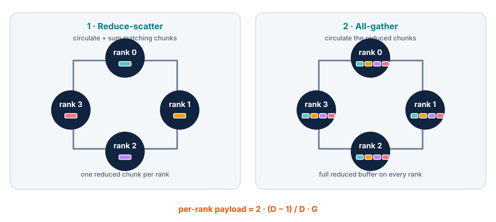
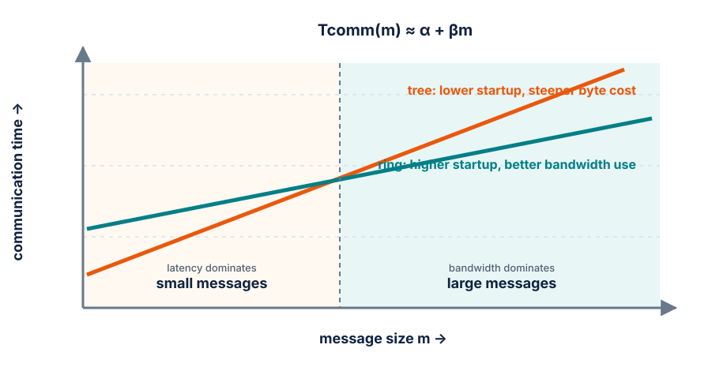

# Module 5 — Distributed data parallelism

## Purpose

Scale a correct single-GPU trainer across replicated model copies without
silently changing the data order, global batch or optimizer update.

This module follows the data-parallel progression in the
[Ultra-Scale Playbook](https://huggingface.co/spaces/nanotron/ultrascale-playbook):
start from independent micro-batches, derive the required gradient reduction,
then overlap that communication with backward computation.

!!! tip "Catch-up primer: Distributed primitives"
    For a unified reference covering collective communication primitives (All-Reduce, Reduce-Scatter, All-Gather, All-to-All, P2P), autograd adjoints, and network cost models across all distributed modules, consult the [Distributed primitives primer](../primers/distributed-primitives.md).

## Learning goals

By the end of the module, students should be able to:

- distinguish rank, local rank, world size, process and node;
- derive why averaging gradients preserves synchronous data-parallel SGD;
- calculate local and global batch sizes in samples and tokens;
- explain ring all-reduce, gradient buckets and backward overlap;
- combine DDP with gradient accumulation using `no_sync` correctly;
- test parameter synchronization and sample coverage;
- separate throughput scaling from optimization equivalence.

## One process, one GPU, one model replica

In standard DDP, every rank owns:

- a complete model replica;
- a complete optimizer state;
- a different local micro-batch;
- gradients that are averaged across the data-parallel group.

The usual execution model launches one process per GPU. `RANK` identifies the
process globally, `LOCAL_RANK` selects its GPU within the node, and `WORLD_SIZE`
is the total number of ranks.

Initialization must agree on model parameters. This is typically achieved by
constructing identical models and broadcasting parameters from rank 0. After
that, deterministic optimizer updates applied to averaged gradients keep the
replicas synchronized.

## Derive the gradient average

Suppose rank \(r\) processes \(m\) examples and computes a mean local loss:

\[
\mathcal{L}_r = \frac{1}{m}\sum_{i=1}^{m} \ell_{r,i}.
\]

With \(D\) ranks, the global batch mean is

\[
\mathcal{L}_{\text{global}}
= \frac{1}{D}\sum_{r=1}^{D}\mathcal{L}_r.
\]

By linearity,

\[
\nabla\mathcal{L}_{\text{global}}
= \frac{1}{D}\sum_{r=1}^{D}\nabla\mathcal{L}_r.
\]

Therefore DDP can compute local backward passes independently, then all-reduce
and average each gradient. If local batches have different valid-token counts,
averaging rank-local *means* is no longer the true global token mean; weight by
the counts or construct equal-token batches.

## Batch accounting

Let:

- \(B_\mu\): samples per local micro-batch;
- \(S\): tokens per sample;
- \(A\): accumulation steps;
- \(D\): data-parallel world size.

Then

\[
B_{\text{global,samples}} = B_\mu A D
\]

and

\[
B_{\text{global,tokens}} = B_\mu S A D.
\]

Moving a single-GPU run to \(D\) GPUs while keeping \(B_\mu\) and \(A\)
unchanged multiplies the global batch by \(D\). That is a new optimization
experiment, not an equivalent faster run.

To preserve a fixed global batch, trade sequential accumulation for parallel
replicas where divisibility and memory allow. For example:

| GPUs \(D\) | local micro-batch \(B_\mu\) | accumulation \(A\) | global samples |
| ---: | ---: | ---: | ---: |
| 1 | 4 | 8 | 32 |
| 2 | 4 | 4 | 32 |
| 4 | 4 | 2 | 32 |
| 8 | 4 | 1 | 32 |

## Ring all-reduce

An all-reduce returns the elementwise reduction to every rank. A common ring
implementation can be understood as:

1. **reduce-scatter:** split each tensor into chunks; circulate and sum them so
   every rank ends with one reduced chunk;
2. **all-gather:** circulate those chunks so every rank reconstructs the full
   reduced tensor.

<figure markdown="span">
  { loading=lazy }
  <figcaption>Reduce-scatter distributes ownership; all-gather restores the complete reduced buffer on every rank.</figcaption>
</figure>

For a gradient payload of \(G\) bytes and \(D\) ranks, each rank transfers
approximately

\[
2\frac{D-1}{D}G
\]

bytes, ignoring latency and protocol details. The payload per rank approaches
\(2G\) as \(D\) grows; adding ranks does not make gradient communication vanish.

### Latency and bandwidth select the collective algorithm

A first communication model separates fixed startup from bytes moved:

\[
T_{\mathrm{comm}}(m) \approx \alpha + \beta m,
\]

where \(\alpha\) is message-launch latency and \(\beta\) is approximately the
inverse effective bandwidth. Splitting a payload into more chunks can expose
more parallel channels, but every chunk must remain large enough to amortize
its launch cost.

<figure markdown="span">
  { loading=lazy }
  <figcaption>Small collectives are latency-sensitive. Large gradient buffers reward bandwidth-efficient algorithms.</figcaption>
</figure>

This explains why a tree-style all-reduce can win for small tensors or large
rank counts, while a ring often wins for large contiguous buffers. Real NCCL
selection also depends on topology, channels, protocol and contention, so use
the model to predict a crossover and the profiler to locate it.

The important performance variables are:

- total gradient bytes;
- effective link bandwidth and topology;
- number and size of collective launches;
- how much communication can overlap with backward computation;
- the exposed tail after the earliest layer's gradient is ready.

## Overlap backward and communication

Backward computes gradients from the last layer toward the first. As soon as a
later layer's gradients are ready, their reduction can begin while earlier
layers are still running backward.

DDP groups parameters into **buckets**. Autograd hooks mark gradients ready;
when a bucket is complete, an asynchronous all-reduce starts on a communication
stream.

Bucket size creates a trade-off:

- too small: many latency-dominated collectives;
- too large: communication starts late, reducing overlap;
- parameter ordering can delay a bucket if one contained gradient arrives late.

The profiler should show compute and NCCL activity overlapping. “DDP is slow”
is not a diagnosis until the trace shows whether the problem is collective
bandwidth, late buckets, input imbalance or idle ranks.

## Gradient accumulation and `no_sync`

With \(A\) micro-steps, synchronizing after every backward pass is unnecessary.
Local gradients can accumulate for the first \(A-1\) micro-steps; the final
backward triggers one reduction of the accumulated result.

Conceptually:

```text
micro-step 1: forward + backward, local only
micro-step 2: forward + backward, local only
...
micro-step A: forward + backward + gradient all-reduce
clip → optimizer step → zero gradients
```

PyTorch's `no_sync()` suppresses DDP gradient synchronization on the non-final
micro-steps. Two common errors are:

- synchronizing every micro-step, which is correct but wastes communication;
- suppressing synchronization on the final micro-step, after which replicas
  update using different gradients and diverge.

Loss scaling must still make the accumulated gradients represent the intended
global mean.

## Distributed sampling is part of correctness

At each epoch or logical pass, every rank needs a distinct shard of the same
global sample order. Verify:

- no unintended cross-rank overlap;
- intended coverage of the dataset;
- deterministic epoch-dependent shuffling;
- correct handling of a final incomplete global batch;
- document/sequence boundaries remain valid;
- resumed jobs continue from a defined data position.

`drop_last=True`, sampler padding and repeated examples each change coverage.
They may be reasonable, but must be declared. Log global token counts by
reducing local counts, not by printing rank 0's local number as if it were
global.

## What must be rank-aware?

| Concern | Rule |
| --- | --- |
| device selection | bind each process to its local GPU before allocation |
| random seeds | separate shared initialization from per-rank data randomness |
| logging | aggregate metrics; avoid duplicated external logs |
| evaluation | shard and reduce correctly, or evaluate on one rank with barriers |
| checkpoint writing | one coordinated writer or a deliberate sharded format |
| failures | make every rank exit; one hanging rank can stall a collective |
| timing | synchronize and measure the slowest rank |

## Correctness ladder

Do not begin with a long scaling run.

### 1. Initialization equality

Hash or compare parameters across ranks immediately after DDP construction.

### 2. One global batch equivalence

Compare one DDP optimizer update with a single-process update on the concatenated
global batch. Disable stochastic layers or control their randomness. Parameters
should match within an explicit floating-point tolerance.

### 3. Synchronization after update

Check the maximum parameter difference across ranks. A nonzero drift after an
intended synchronous update is a correctness failure.

### 4. Sample-ID audit

Log sample IDs from every rank for a short epoch and verify overlap and coverage.

### 5. Resume test

Save, restart with the same world size and compare the next update with an
uninterrupted reference. If world-size changes are supported, test that as a
separate contract.

## Scaling efficiency

Strong scaling holds the global workload fixed and asks whether more GPUs finish
it faster. Weak scaling holds per-GPU work fixed and grows the global workload.
Do not mix the two.

For throughput \(Q_D\) on \(D\) GPUs relative to one-GPU throughput \(Q_1\):

\[
\text{speedup} = \frac{Q_D}{Q_1},
\qquad
\text{scaling efficiency} = \frac{Q_D}{D Q_1}.
\]

Report useful global tokens/s, step time and validation behavior. Also inspect
per-rank times: the collective proceeds at the pace of the slowest participant.

## In-class investigation

### Part A — batch invariants

For a target of 524,288 tokens/update at sequence length 1024, construct valid
\((B_\mu, A, D)\) settings for 1, 2, 4 and 8 GPUs. State which setting is likely
to have the best matrix shapes and which has the least accumulation latency.

### Part B — all-reduce estimate

Given a parameter count, gradient dtype, world size and measured link bandwidth:

1. estimate gradient bytes;
2. estimate ring traffic per rank;
3. calculate an optimistic communication time;
4. compare it with backward time;
5. predict how much can be hidden.

### Part C — trace diagnosis

Annotate a DDP trace with backward kernels, bucket reductions and idle gaps.
Propose one change—bucket size, micro-batch, accumulation or data loading—and
state what the new trace should look like if the hypothesis is correct.

## Exit ticket

1. Why is averaging local gradients equivalent to a global batch only under
   compatible loss normalization?
2. Why can more GPUs change optimization even when the code is unchanged?
3. What does `no_sync` save, and on which micro-step must it be disabled?
4. Why do gradient buckets help overlap but also introduce a tuning trade-off?
5. What evidence proves that all replicas remain synchronized?

## Expected output

A multi-GPU run with a one-update equivalence test, verified parameter
synchronization, audited sample coverage, global token accounting and a strong-
scaling report supported by a profiler trace.

## References

- [The Ultra-Scale Playbook — Data Parallelism](https://huggingface.co/spaces/nanotron/ultrascale-playbook#data-parallelism)
  — main conceptual and performance reference;
- [PyTorch DistributedDataParallel tutorial](https://docs.pytorch.org/tutorials/intermediate/ddp_tutorial.html)
  — process setup and DDP behavior;
- [NCCL collective performance](https://github.com/NVIDIA/nccl-tests/blob/master/doc/PERFORMANCE.md)
  — bus bandwidth conventions for collectives;
- [Picotron data parallelism](https://github.com/huggingface/picotron/tree/main/picotron/data_parallel)
  — compact implementation for code reading.
- Edouard Oyallon, *Training and Deploying Large-Scale Models*, MVA Lecture 2
  (2026) — Hockney communication model and tree/ring all-reduce crossover.

---

[:material-file-pdf-box: View Lecture Slides (PDF)](../slides/05-ddp.pdf){ .md-button target="_blank" }
[:material-code-tags: Practical Companion Guide](../companion/05-ddp.md){ .md-button .md-button--primary }

