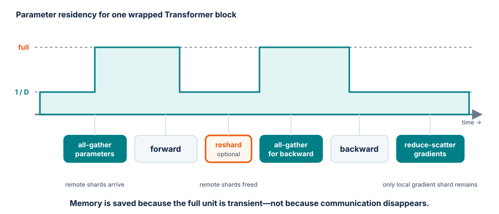
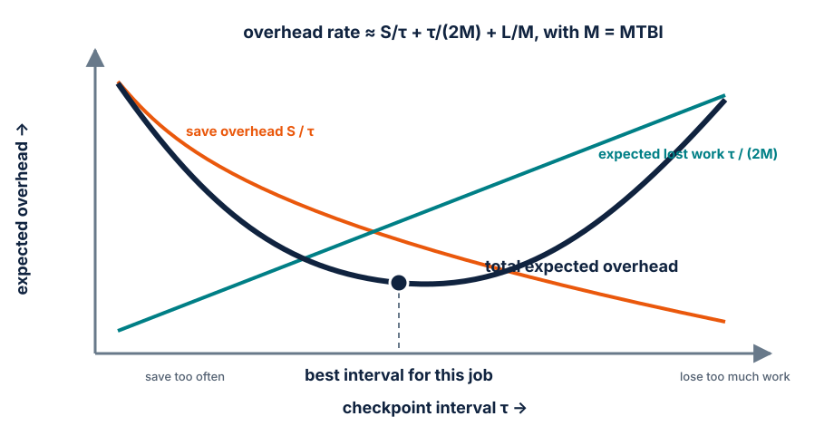

# Module 8 — FSDP and ZeRO

## Purpose

Understand why replicated data parallelism runs out of memory, then derive how
sharding parameters, gradients and optimizer state trades memory for
communication.

The main conceptual path follows the
[Ultra-Scale Playbook's ZeRO section](https://huggingface.co/spaces/nanotron/ultrascale-playbook#zero-zero-redundancy-optimizer),
with PyTorch FSDP as the concrete system studied in class.

## Learning goals

By the end of the module, students should be able to:

- account for persistent model-state memory by dtype;
- explain ZeRO stages 1–3 and which redundancy each removes;
- derive the all-gather and reduce-scatter pattern of full sharding;
- distinguish sharded residency from temporary materialization;
- explain how wrapping and resharding affect peak memory and overlap;
- choose between full, sharded and distributed checkpoint formats;
- compare FSDP and DDP without changing the training semantics.

## The redundancy in DDP

DDP gives every rank a complete copy of:

- model parameters;
- gradients;
- optimizer moments and any master parameters.

Only the activations are naturally different, because each rank processes a
different micro-batch. If one rank uses \(M\) bytes for persistent model state,
\(D\) DDP ranks use roughly \(DM\) bytes in aggregate while every rank still
needs enough memory for the full model.

For \(\Psi\) parameters, a common AdamW mixed-precision accounting is:

| State | Bytes per parameter | Replicated DDP bytes |
| --- | ---: | ---: |
| BF16 parameters | 2 | \(2\Psi\) |
| BF16 gradients | 2 | \(2\Psi\) |
| FP32 master parameters + Adam moments | 12 | \(12\Psi\) |
| **Total before activations/temporaries** | **16** | **\(16\Psi\)** |

Some systems keep FP32 gradients, omit master parameters or use different
optimizer-state precision. Always replace the example with the measured state
layout of the actual framework.

## ZeRO as progressive sharding

ZeRO removes a different form of data-parallel redundancy at each stage. With
data-parallel degree \(D\):

| Method | Parameters | Gradients | Optimizer state | Approximate persistent bytes/rank |
| --- | --- | --- | --- | ---: |
| DDP / ZeRO-0 | replicated | replicated | replicated | \(16\Psi\) |
| ZeRO-1 | replicated | replicated | sharded | \(4\Psi + 12\Psi/D\) |
| ZeRO-2 | replicated | sharded | sharded | \(2\Psi + 14\Psi/D\) |
| ZeRO-3 / full sharding | sharded | sharded | sharded | \(16\Psi/D\) |

These simplified formulas exclude activations, communication buffers,
allocator effects and temporary full parameters. They predict the trend, not
the exact peak.

### ZeRO-1 — optimizer-state sharding

Each rank owns optimizer state for only one parameter shard. After gradients
are reduced and local shards are updated, the updated parameters must be made
available to all replicas for the next forward pass.

### ZeRO-2 — add gradient sharding

A reduce-scatter both sums gradients and leaves each rank only the shard needed
by its optimizer. There is no reason for every rank to retain the full reduced
gradient if it updates only a parameter shard.

### ZeRO-3 / FSDP — add parameter sharding

No rank keeps all parameters resident. Before a sharded unit computes, its
parameter shards are all-gathered; after use they can be discarded or resharded.
Backward needs the parameters again and reduce-scatters the resulting gradients.

## One fully sharded unit, step by step

For one Transformer block wrapped as an FSDP unit:

1. every rank begins with its local parameter shard;
2. **all-gather parameters** for the block;
3. run the block's forward computation;
4. optionally **reshard after forward**, releasing remote shards;
5. before backward, all-gather the parameters again if they were resharded;
6. compute local gradients for the block;
7. **reduce-scatter gradients**, leaving each rank its reduced shard;
8. update the local parameter shard with local optimizer state.

<figure markdown="span">
  { loading=lazy }
  <figcaption>Full parameters exist only around the unit's compute. The wrapping and resharding policy controls the height and duration of that transient peak.</figcaption>
</figure>

This reveals the central trade-off:

- resharding quickly lowers peak residency but may require a second parameter
  all-gather before backward;
- keeping full parameters until backward uses more memory but can save that
  communication.

Prefetching the next unit's all-gather while the current unit computes can hide
some communication. Prefetching too aggressively can materialize several units
at once and destroy the predicted memory savings.

## Wrapping defines the unit of materialization

The wrapping policy is part of the performance model.

### One unit for the entire model

- simple, few collectives;
- materializes the full model at once;
- little memory advantage during compute;
- communication is difficult to overlap layer by layer.

### One unit per Transformer block

- bounds temporary full parameters to roughly one or a few blocks;
- enables forward/backward prefetch and overlap;
- introduces more collective launches;
- matches the repeated structure of the model.

### Very small units

- lower materialization granularity;
- many latency-dominated collectives;
- more complicated ordering and memory behavior.

The best unit is large enough for efficient collectives and small enough to fit
with activations and temporary buffers. Validate with both a memory timeline and
a communication trace.

## Communication volume versus communication exposure

Sharding does not make the full parameter set disappear from the computation.
It moves parameter shards when layers need them.

For a ring collective on \(P\) bytes across \(D\) ranks, a rank transfers
approximately

\[
\frac{D-1}{D}P
\]

for one all-gather or reduce-scatter. A fully sharded block normally requires:

- one parameter all-gather in forward;
- another in backward if parameters were resharded;
- one gradient reduce-scatter in backward.

Whether this slows the step depends on **exposed** communication: the portion
that cannot overlap with useful compute. A large model with substantial
per-layer computation can hide more parameter movement than a tiny course
model. Therefore FSDP may save memory yet be slower than DDP in the classroom
experiment. That is an informative result, not a failure.

## FSDP does not solve activation memory by itself

Data-parallel ranks process different samples, so their activations are not
duplicate copies of the same tensor and cannot be divided by ZeRO in the same
way as model state.

Combine techniques according to the source of pressure:

| Memory pressure | Primary lever |
| --- | --- |
| optimizer/model state dominates | FSDP / ZeRO |
| activations dominate due to micro-batch | gradient accumulation |
| saved activations dominate | activation checkpointing |
| attention matrix dominates | efficient SDPA / FlashAttention |
| long sequence remains too large | sequence/context parallelism |

If an OOM remains after sharding, inspect the memory snapshot instead of
blindly increasing the sharding degree.

## Mixed precision and reduction precision

FSDP can use different dtypes for:

- parameters used in forward/backward;
- gradient reduction;
- optimizer state.

Reducing in lower precision saves communication bandwidth but can change
numerical behavior. Keeping optimizer state in FP32 improves stability but
retains its byte cost—albeit sharded. State these choices in every comparison.

## Checkpointing is a distributed data problem

A training checkpoint must preserve model, optimizer and scheduler state across
the same logical parameters even when their physical shards differ.

### Full checkpoint

Parameters are gathered into an ordinary state dictionary, often on one rank.

- easy to load in non-sharded inference code;
- simple artifact to publish;
- can exceed one rank's RAM or create a long pause;
- optimizer gathering can be especially large.

### Sharded checkpoint

Each rank writes the shards it owns plus metadata.

- parallel IO and no rank-0 memory spike;
- better for large training restarts;
- requires coordinated metadata and a compatible loader;
- resharding for a new world size must be explicitly supported.

### Distributed checkpoint

A framework-managed format maps logical tensors to storage shards and may load
into a different device mesh. Treat its manifest and metadata as part of the
artifact, not disposable implementation detail.

### Checkpoint cadence is an expected-cost decision

Let \(\tau\) be the interval between checkpoints, \(S\) the exposed time to
save one checkpoint, \(L\) the recovery load time and \(M\) the mean time
between interruptions. A useful approximation to the overhead rate is

\[
\frac{S}{\tau} + \frac{\tau}{2M} + \frac{L}{M}.
\]

The first term penalizes saving too often. The second is the expected training
work lost at failure when interruptions arrive uniformly inside an interval.
The load term does not choose \(\tau\), but it determines the total recovery
cost and motivates faster checkpoint formats.

<figure markdown="span">
  { loading=lazy }
  <figcaption>The best cadence depends on measured save time and observed interruption rate, not on a universal step count.</figcaption>
</figure>

Asynchronous saves reduce exposed \(S\) only if GPU-to-CPU staging and storage
traffic remain off the training critical path. Measure step-time disturbance,
durable completion time and restart time separately.

Checkpoint validation requires a fresh-process load followed by evaluation and
at least one optimizer update. Listing files is not a restore test.

## DDP versus FSDP experimental contract

Keep fixed:

- initial logical parameters;
- global batch and exact samples per update;
- loss reduction and optimizer hyperparameters;
- precision policy unless precision is the tested variable;
- total optimizer updates;
- evaluation batches.

Measure:

| Quantity | Why |
| --- | --- |
| maximum parameter delta after one update | correctness equivalence |
| peak allocated/reserved memory per rank | actual capacity benefit |
| tokens/s and step-time distribution | throughput cost |
| all-gather/reduce-scatter trace | communication explanation |
| checkpoint bytes and save/load time | operational cost |
| restored validation loss | checkpoint correctness |

## In-class investigation

### Part A — memory prediction

For a 7B-parameter model with the 16-byte example budget:

1. estimate DDP persistent state per rank;
2. estimate ZeRO-1, ZeRO-2 and full-shard state for \(D=8\);
3. add a declared activation budget and 10% temporary-memory margin;
4. decide which configurations fit an 80 GB GPU;
5. explain why the full-shard *peak* may exceed the formula.

### Part B — collective timeline

Draw two consecutive FSDP blocks during forward and backward. Mark parameter
all-gathers, compute, resharding and gradient reduce-scatters. Identify which
collective can be prefetched and what memory it temporarily adds.

### Part C — checkpoint choice

Choose a format for each case:

1. restart a 256-GPU training job quickly;
2. publish weights for single-GPU inference;
3. resume on a different world size;
4. archive optimizer state for exact recovery.

State the loader and validation procedure, not just the format name.

## Exit ticket

1. Which state first becomes sharded in ZeRO-1?
2. Why can ZeRO-3 need parameters twice in one training step?
3. How does FSDP unit size affect latency, overlap and peak memory?
4. Why can FSDP save memory but reduce tokens/s on a small model?
5. What evidence demonstrates that a sharded checkpoint is usable?

## Expected output

A focused DDP/FSDP comparison with predicted and measured memory, update
equivalence, a communication trace, throughput results and a verified
checkpoint round trip.

## References

- [The Ultra-Scale Playbook — ZeRO](https://huggingface.co/spaces/nanotron/ultrascale-playbook#zero-zero-redundancy-optimizer)
  — memory formulas, collective patterns and scaling evidence;
- [ZeRO](https://arxiv.org/abs/1910.02054)
  — the original staged redundancy analysis;
- [PyTorch FSDP2 tutorial](https://docs.pytorch.org/tutorials/intermediate/FSDP_tutorial.html)
  — current PyTorch sharding model and usage;
- [PyTorch Distributed Checkpoint](https://docs.pytorch.org/docs/stable/distributed.checkpoint.html)
  — sharded save/load concepts and APIs.
- Edouard Oyallon, *Training and Deploying Large-Scale Models*, MVA Lecture 4
  (2026) — checkpoint frequency, recovery overhead and lost-compute trade-offs.

---

[:material-file-pdf-box: View Lecture Slides (PDF)](../slides/08-fsdp.pdf){ .md-button target="_blank" }
[:material-code-tags: Practical Companion Guide](../companion/08-fsdp.md){ .md-button .md-button--primary }

