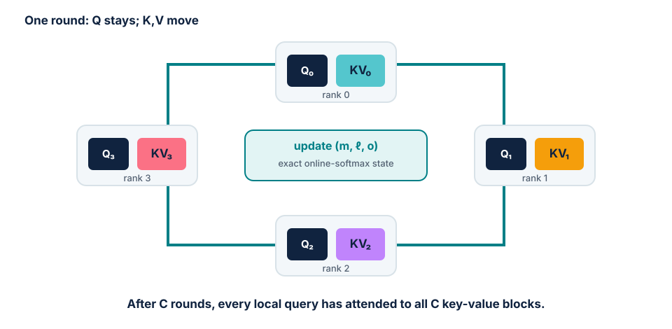

# Module 10 — Context and pipeline parallelism

## Purpose

Choose a parallelization strategy from model size, context length, batch target
and cluster topology. Context parallelism and pipeline parallelism both divide
work that tensor parallelism cannot handle efficiently, but they attack
different axes and create different communication patterns.

The main reference is the
[Ultra-Scale Playbook](https://huggingface.co/spaces/nanotron/ultrascale-playbook),
especially its context-parallel, pipeline-parallel and configuration-selection
sections.

## Learning goals

By the end of the module, students should be able to:

- distinguish sequence parallelism from context parallelism;
- explain why attention makes sequence sharding non-local;
- trace ring attention and online-softmax state across ranks;
- explain causal load imbalance and zig-zag sequence placement;
- derive pipeline bubble and activation-memory trade-offs;
- compare AFAB/GPipe and 1F1B schedules;
- map TP, CP, PP and data sharding onto fast and slow network domains;
- defend a multidimensional strategy with explicit memory and communication
  estimates.

## Two different sequence-axis ideas

The terminology is overloaded, so this course uses a strict distinction:

| Technique | Where sequence is sharded | Main purpose |
| --- | --- | --- |
| **Sequence parallelism (SP)** | only operations outside TP regions, such as normalization and residual/dropout | remove replicated activation residency created by TP |
| **Context parallelism (CP)** | through the full Transformer layer, including attention | make very long sequences fit and divide their computation |

SP is a companion to tensor parallelism. CP is an additional parallel axis that
can be used even when the main problem is context length rather than hidden
width.

## Why most layers are easy to shard by token

LayerNorm, RMSNorm and MLP projections act independently on each token once
their hidden vector is available. If the sequence is divided across \(c\) CP
ranks, each rank can run these operations on \(T/c\) tokens using the same
weights.

Attention is different. A query token needs keys and values from every visible
context position:

\[
O_i = \mathrm{softmax}\left(\frac{Q_i K_{\le i}^{\top}}{\sqrt{d_h}}\right)
V_{\le i}.
\]

After sequence sharding, the local rank owns only part of \(K\) and \(V\).
Correct global attention therefore requires communication.

## Ring attention

Assume \(c\) ranks, each holding local queries \(Q_r\) and one chunk of keys
and values \((K_r, V_r)\). In a ring implementation, every rank repeatedly:

1. starts an asynchronous send of its current KV chunk to the next rank;
2. computes the attention contribution between local queries and the current
   KV chunk;
3. receives the next KV chunk from the previous rank;
4. updates the running attention result;
5. repeats until all required chunks have circulated.

Communication can be hidden when computing one block takes at least as long as
moving the next block. The rank holds only a small number of KV chunks at once,
rather than all-gathering the full context.

<figure markdown="span">
  { loading=lazy }
  <figcaption>Queries stay local; key-value blocks rotate. After \(C\) rounds, every query block has seen the full context.</figcaption>
</figure>

### Online softmax makes blockwise attention exact

Softmax seems to require all logits at once because every output uses the
global row maximum and normalization sum. Online softmax keeps, for each query
row:

- running maximum \(m\);
- running exponential sum \(\ell\);
- running weighted-value accumulator \(o\).

For a new block of logits \(s\) with block maximum \(m_b\), update

\[
m' = \max(m, m_b),
\]

\[
\ell' = e^{m-m'}\ell + \sum_j e^{s_j-m'},
\]

\[
o' = e^{m-m'}o + \sum_j e^{s_j-m'}V_j.
\]

After all blocks, the attention output is \(o/\ell\). This is the same
mathematical result as full softmax up to floating-point ordering. FlashAttention
uses the same broad blockwise/online principle inside one GPU; ring attention
extends the movement across GPUs.

## Causal attention creates load imbalance

In causal attention, early queries see few keys while late queries see many. A
contiguous placement gives early sequence chunks systematically less work than
later chunks. Some ranks finish local attention blocks early while others still
compute the dense lower-right region of the causal matrix.

**Zig-zag placement** balances the triangle by assigning each rank a mixture of
early and late chunks. For example, a rank may receive one chunk from the start
and one from the end rather than one contiguous interval. The total number of
visible query-key pairs becomes more even.

This is a general systems lesson: equal tensor shapes do not guarantee equal
work when a mask changes the number of useful operations.

## All-gather versus ring exchange

| Design | Communication pattern | Temporary memory | Overlap |
| --- | --- | --- | --- |
| gather all KV | all ranks materialize full KV | high | simple but limited |
| ring KV blocks | circulate one block at a time | low | communication can overlap block compute |

The ring is not always faster. Small blocks may be latency-bound, and an
all-gather may win when the full KV fits comfortably and the interconnect is
fast. Benchmark the real sequence length and head layout.

## When context parallelism helps

CP is motivated when:

- one sequence's activations do not fit on one GPU or node;
- attention work at the target context is large enough to amortize KV exchange;
- reducing micro-batch size further would make matrices inefficient;
- the model weights already fit under the chosen DP/FSDP/TP layout.

CP does not reduce total attention work. It divides it and pays communication.
Short contexts usually do not justify that cost.

---

## Pipeline parallelism: split by depth

Pipeline parallelism assigns consecutive—or sometimes interleaved—groups of
layers to stages. A micro-batch moves forward through the stages; its activation
gradient moves backward in reverse.

Compared with tensor parallelism, PP communicates much less frequently: mostly
the activation at stage boundaries, not several tensors inside every layer.
This makes PP attractive across slower inter-node links when a model no longer
fits inside one fast-link domain.

The difficulty is utilization. A naive full batch uses stage 0, then stage 1,
and so on, leaving most devices idle.

## Micro-batches fill the pipeline

Split one global batch into \(m\) micro-batches and use \(p\) pipeline stages.
Once stage 0 sends micro-batch 1 to stage 1, it can begin micro-batch 2.

For balanced stages with a simple all-forward-all-backward schedule, the bubble
overhead relative to ideal work is approximately

\[
r_{\text{bubble}} = \frac{p-1}{m},
\]

and the corresponding idealized utilization is

\[
U \approx \frac{m}{m+p-1}.
\]

More micro-batches shrink the bubble, but the target global batch limits \(m\),
and very small micro-batches can make local matrix multiplications inefficient.

### Worked example

With \(p=4\) stages and \(m=8\) micro-batches:

\[
r_{\text{bubble}} = \frac{3}{8}=37.5\%,
\qquad
U = \frac{8}{11}\approx72.7\%.
\]

Doubling to 16 micro-batches improves the idealized utilization to
\(16/19\approx84.2\%\), but it does not fix stage imbalance or communication
stalls.

## AFAB/GPipe versus 1F1B

### All-forward-all-backward (AFAB)

Run forward for every micro-batch, then backward for every micro-batch.

- simple schedule and clean phase separation;
- same first-order bubble as the basic pipeline;
- stores forward activations for all \(m\) micro-batches until backward;
- activation memory can dominate.

### One-forward-one-backward (1F1B)

After warmup, each stage alternates one forward and one backward operation.

- begins freeing activations earlier;
- activation residency is closer to pipeline depth \(p\) than total
  micro-batches \(m\);
- permits larger \(m\) under the same memory budget;
- requires distributed scheduling of forward and backward work;
- does not by itself remove the basic bubble.

Interleaved and zero-bubble schedules split a physical device into multiple
virtual stages or schedule parameter-gradient work more aggressively. They can
reduce idle time at the cost of more transfers and substantially greater
implementation complexity. Understand AFAB and 1F1B before treating those
schedules as names on a configuration menu.

## Pipeline stage balance

Equal layer counts do not imply equal stage times. Embeddings, the LM head,
attention at different sequence regimes, and tied weights can make boundary
stages heavier. The slowest stage determines steady-state throughput.

Balance with measured forward/backward times and memory, while respecting:

- residual and module boundaries;
- tied embedding/output weights;
- stage-boundary activation size;
- recomputation policy;
- physical topology and rank placement.

Moving one layer can improve compute balance while creating an OOM or a larger
communication boundary.

## Pipeline communication

A boundary activation has roughly \(B_\mu T d\) elements per micro-batch, plus
the corresponding gradient in backward. PP communication grows with activation
size, not total parameter count, and occurs only between adjacent stages.

It is therefore usually cheaper across nodes than TP, but it lies on the
critical path: the next stage cannot run that micro-batch until the activation
arrives. Low volume does not mean zero latency.

## Compose the parallel dimensions

For total GPU count \(G\), a dense training layout may satisfy

\[
G = D \times F \times T_P \times C \times P,
\]

where:

- \(D\): replicated data-parallel degree;
- \(F\): fully sharded data-parallel degree;
- \(T_P\): tensor-parallel degree;
- \(C\): context-parallel degree;
- \(P\): pipeline-parallel degree.

Frameworks group these axes differently, but the product and topology mapping
must be explicit.

### A practical selection order

1. **Fix optimization requirements:** target global tokens/update and sequence
   length.
2. **Fit one micro-batch:** account for parameters, optimizer, gradients,
   activations and temporary buffers.
3. **Use recomputation/efficient attention** for activation pressure that does
   not require another device.
4. **Choose the smallest fast-domain TP** that makes layers fit and preserves
   efficient local matrices.
5. **Add CP** when a single long sequence remains the pressure.
6. **Add PP** when model depth must span nodes or TP would cross a slow link.
7. **Use DP/FSDP on remaining devices** to reach the global batch and shard
   redundant state.
8. **Benchmark alternatives:** analytical models reject impossible layouts;
   traces decide among plausible ones.

### Topology rule of thumb

Place frequent latency-sensitive collectives such as TP on the fastest links.
Use PP across slower links because it communicates less often. DP/FSDP can span
nodes when enough per-rank compute hides reductions or parameter movement. CP
placement depends on KV volume and whether its ring can overlap attention.

## Strategy case studies

### Case A — model fits, short context, more GPUs available

Prefer DDP. TP, CP and PP add communication without solving a capacity problem.

### Case B — one wide layer does not fit inside one GPU

Use TP within a fast-link node; add sequence parallelism if non-TP activations
remain replicated.

### Case C — weights fit, 128k-token examples do not

Use efficient attention and recomputation first, then CP if one sequence still
does not fit or attention work needs division.

### Case D — model cannot fit in one node

Use PP to divide layers across nodes, with TP inside nodes if needed. Select
enough micro-batches to control the bubble without violating the global batch.

## In-class investigation

### Part A — ring-attention trace

For four ranks and eight sequence chunks:

1. assign chunks contiguously and count causal query-key pairs per rank;
2. propose a zig-zag assignment;
3. trace four KV exchanges for one rank;
4. list the online-softmax state carried between blocks;
5. identify which communication can overlap compute.

### Part B — pipeline schedule

Draw AFAB and 1F1B timelines for \(p=4\), \(m=8\). Calculate bubble ratio and
peak number of resident micro-batch activations per stage. Mark warmup, steady
state and cooldown.

### Part C — cluster design

For each supplied model/cluster case:

1. show a per-rank memory budget;
2. choose \((D,F,T_P,C,P)\);
3. map each process group to the physical topology;
4. identify the dominant collective or bubble;
5. compute global tokens/update;
6. state one alternative layout and why it loses;
7. name the first benchmark needed to validate the choice.

## Exit ticket

1. Why is context parallelism harder for attention than for the MLP?
2. What state makes blockwise online softmax exact?
3. Why does contiguous causal sequence sharding create imbalance?
4. How do more micro-batches affect bubble and activation memory in AFAB?
5. Why is pipeline parallelism often placed across nodes while TP stays within
   a node?

## Expected output

A defended scaling design for several model/context/cluster cases, including
memory budgets, process-group dimensions, topology placement, pipeline
utilization, dominant communication and the measurement that would validate or
reject each strategy.

## References

- [The Ultra-Scale Playbook — Context Parallelism](https://huggingface.co/spaces/nanotron/ultrascale-playbook#context-parallelism)
  — ring attention, causal balancing and scaling results;
- [The Ultra-Scale Playbook — Pipeline Parallelism](https://huggingface.co/spaces/nanotron/ultrascale-playbook#pipeline-parallelism)
  — AFAB, 1F1B, interleaving and bubble analysis;
- [The Ultra-Scale Playbook — Finding the Best Training Configuration](https://huggingface.co/spaces/nanotron/ultrascale-playbook#finding-the-best-training-configuration)
  — multidimensional selection workflow;
- [PyTorch context-parallel tutorial](https://docs.pytorch.org/tutorials/unstable/context_parallel.html)
  — current PyTorch context-parallel interface;
- [PyTorch pipeline-parallel tutorial](https://docs.pytorch.org/tutorials/intermediate/pipelining_tutorial.html)
  — stage construction and schedules;
- [Picotron](https://github.com/huggingface/picotron)
  — minimal code for reading the communication patterns.

---

[:material-file-pdf-box: View Lecture Slides (PDF)](../slides/10-context-pipeline.pdf){ .md-button target="_blank" }
[:material-code-tags: Practical Companion Guide](../companion/10-context-pipeline.md){ .md-button .md-button--primary }

