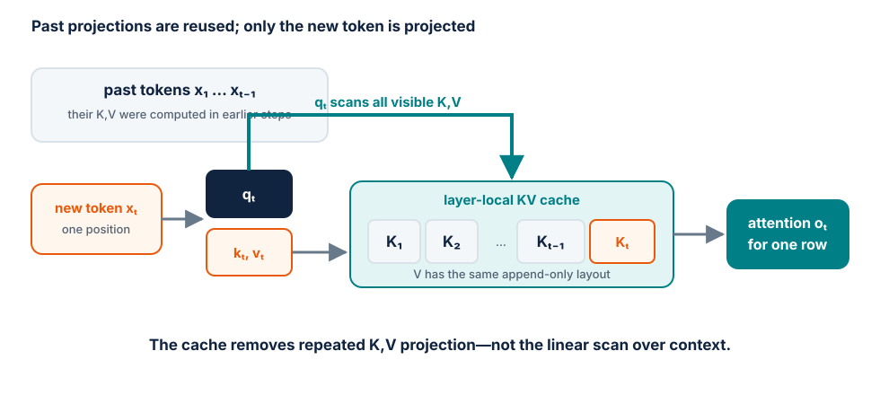

# Module 11 — KV-cached decoding

## Purpose

Derive the repeated work in naive autoregressive generation, remove it without
changing model outputs, and understand the new memory-bandwidth bottleneck that
the optimization creates.

The intuition follows
[KV Cache Explained Intuitively](https://medium.com/@saad.ahmed1926q/kv-cache-explained-intuitively-2b425a36dfc7):
past tokens do not change when a new token is appended, so their keys and
values should not be recomputed. This module makes that intuition precise in
shapes, bytes and correctness tests.

## Learning goals

By the end of the module, students should be able to:

- distinguish prefill from decode;
- explain why K and V are reusable but a new Q is still required;
- derive KV-cache shapes and byte cost for MHA, MQA and GQA;
- explain why cached decode often becomes memory-bandwidth-bound;
- handle position offsets, masks and maximum context correctly;
- design an equivalence test for cached and uncached logits;
- benchmark time to first token separately from per-token decode latency.

## Autoregressive generation without a cache

Given a prompt \(x_{1:P}\), the model predicts \(x_{P+1}\), appends it, then
runs again on \(x_{1:P+1}\). If the full prefix is passed on every step, layer
\(\ell\) repeatedly computes

\[
K^{(\ell)}_{1:t} = H^{(\ell)}_{1:t}W_K^{(\ell)},
\qquad
V^{(\ell)}_{1:t} = H^{(\ell)}_{1:t}W_V^{(\ell)}
\]

for tokens whose hidden states were already processed in previous steps.

Causality gives the key invariant: appending token \(x_{t+1}\) cannot change
the layer outputs, keys or values at positions \(1,\ldots,t\). The new token
may attend to the past; the past may not attend to the new token.

Therefore the model can store old K/V tensors once and compute only the new
token's projections at the next decode step.

## Two phases with different shapes

### Prefill

The prompt of \(P\) tokens is processed together.

- query length: \(P\);
- key/value length: \(P\);
- large matrix multiplications and a triangular attention pattern;
- creates the initial KV cache;
- usually compute-intensive for substantial prompts.

### Decode

One new token is processed at a time.

- query length: 1 per active sequence;
- key/value length: current context \(T\);
- computes one new K and V per layer and appends them;
- reads all visible cached K/V for attention;
- often bandwidth-bound because matrices are skinny and model/cache bytes must
  be read for very little new-token work.

This difference is why a user sees an initial pause followed by a stream of
tokens. The corresponding metrics are time to first token (TTFT) and inter-token
latency (ITL), or its reciprocal tokens/s for one request.

## Cached attention, one layer

At decode step \(t\), let the new hidden state be
\(h_t \in \mathbb{R}^{B\times1\times d}\). Compute

\[
q_t = h_t W_Q, \qquad k_t = h_t W_K, \qquad v_t = h_t W_V.
\]

Append the new entries:

\[
K_{1:t} = \mathrm{concat}(K_{1:t-1}, k_t),
\qquad
V_{1:t} = \mathrm{concat}(V_{1:t-1}, v_t).
\]

Then calculate only the new output row:

\[
o_t = \mathrm{softmax}\left(
\frac{q_t K_{1:t}^{\top}}{\sqrt{d_h}}
\right)V_{1:t}.
\]

The attention score for one head has shape \(B\times1\times T\), not
\(B\times T\times T\). The cache avoids recomputing old projections and old
query outputs. It does not make attention independent of context length: each
new query still reads and scores visible keys.

<figure markdown="span">
  { loading=lazy }
  <figcaption>One decode step appends one K/V pair per layer and computes only the newest attention row.</figcaption>
</figure>

## Cache shape and memory

Let:

- \(B\): active sequences;
- \(L\): layers;
- \(T\): cached tokens per sequence;
- \(H_{kv}\): key/value heads;
- \(d_h\): head dimension;
- \(q\): bytes per cache element.

K and V at one layer have shape

\[
B \times H_{kv} \times T \times d_h.
\]

The total cache is therefore

\[
M_{KV} = 2BLTH_{kv}d_hq,
\]

where the factor 2 represents K and V.

### Worked example — MHA

For a Llama-2-7B-shaped configuration with \(L=32\), \(H_{kv}=32\),
\(d_h=128\), BF16 (2 bytes), and one sequence:

\[
\text{bytes/token}
= 2 \times 32 \times 32 \times 128 \times 2
= 524{,}288 \text{ bytes}
\]

or 512 KiB per cached token. A 4096-token context needs about 2 GiB of KV
cache for one sequence, before allocator/block overhead. Batch 16 would require
about 32 GiB.

This calculation explains why the cache, rather than the model weights, can
limit serving concurrency.

## MHA, MQA and GQA

The number of query heads does not determine cache size; the number of KV heads
does.

| Attention type | Query heads | KV heads | Relative KV bytes |
| --- | ---: | ---: | ---: |
| Multi-head attention (MHA) | \(H_q\) | \(H_q\) | \(1\) |
| Grouped-query attention (GQA) | \(H_q\) | \(H_{kv}<H_q\) | \(H_{kv}/H_q\) |
| Multi-query attention (MQA) | \(H_q\) | 1 | \(1/H_q\) |

Queries remain separate, but several query heads share the same K/V head. This
reduces cache capacity and bandwidth, with a possible quality trade-off that is
decided during model design/training. Converting an already trained MHA model
to MQA by reshaping tensors is not generally equivalent.

### Example

If \(H_q=32\):

- MHA with 32 KV heads uses the full cache above;
- GQA with 8 KV heads uses one quarter as many KV bytes;
- MQA with 1 KV head uses one thirty-second as many.

## Why cached decode is often bandwidth-bound

At every decode step the GPU must read:

- a large fraction of the model weights;
- all visible KV entries for each active sequence;
- small new-token activations.

The step produces only one new token per sequence. Compared with training or
prefill, the effective token batch presented to large linear layers is small,
so weight reuse is limited. Increasing the batch of concurrent sequences
increases reuse and throughput, but also consumes more KV memory and may worsen
latency.

This is the serving trade-off developed in Module 12:

```text
larger active batch
  → better weight reuse and throughput
  → more cache residency and scheduling delay
  → potentially worse per-request latency
```

## Cache layout choices

A simple educational cache can preallocate

```text
[batch, layers, kv_heads, max_context, head_dim]
```

or keep one K/V tensor per layer. Production kernels often prefer different
orders for contiguous head/token access and vectorized loads.

### Append with concatenation

- simplest to understand;
- repeatedly allocates and copies growing tensors;
- obscures the intended benefit in a benchmark.

### Preallocated contiguous cache

- write K/V into position `cache_position`;
- avoids repeated reallocation;
- reserves the maximum length up front;
- wastes capacity when request lengths vary.

### Paged cache

- allocates fixed-size token blocks on demand;
- maps logical positions through a block table;
- reduces external fragmentation and enables block sharing;
- requires specialized attention kernels and a cache manager.

Paged allocation is a serving-system topic; the mathematical K/V values remain
the same.

## Position and mask correctness

When the model receives one decode token, its local tensor index is zero but
its absolute sequence position is \(t\). Learned absolute embeddings and RoPE
must use the cache offset, not restart from position zero.

For a single unpadded sequence, a new query at the end may attend to every
cached key, so no triangular mask is needed inside the \(1\times T\) row.
Batched variable-length sequences still need metadata or masks that prevent:

- one sequence attending to another sequence's cache;
- attention to uninitialized capacity;
- attention past a sliding-window boundary;
- padding from being treated as real context.

When a rolling context drops old tokens, learned absolute positions and RoPE
semantics require an explicit policy. Cropping the cache and resetting positions
is not automatically equivalent to running the model on the cropped text.

## What the cache must represent

A cache entry is valid only for a particular:

- model and exact weights;
- layer and attention layout;
- input token prefix;
- position-encoding state;
- adapter/LoRA selection, when applicable;
- dtype and possibly quantization scheme.

Editing an earlier token invalidates all downstream K/V because its change can
alter later hidden states. Appending preserves the cache; modifying the middle
does not.

Beam search or branching generation can share the common-prefix blocks, then
fork cache ownership when hypotheses diverge. Copying the entire prefix for
every branch is correct but memory-inefficient.

## Correctness before speed

For a fixed prompt and model in evaluation mode:

1. run an uncached forward pass on the full prompt and record final-position
   logits at every generated step;
2. prefill the cache on the same prompt;
3. decode one token at a time with explicit position offsets;
4. compare cached and uncached logits, not only sampled token IDs;
5. repeat across multiple lengths, batch sizes and cache boundaries.

Use greedy decoding for the end-to-end token test. Stochastic sampling can
diverge after tiny floating-point differences even when both paths are correct.

Test these failure-prone cases:

- one-token prompt;
- prompt exactly at one cache block or allocation boundary;
- variable-length batch;
- maximum context length;
- context overflow policy;
- cache reset followed by a new request;
- shared prefix followed by divergent suffixes.

State numerical tolerances by dtype. Bitwise identity is not guaranteed when
the cached path changes kernel shape or reduction order.

## Benchmark prefill and decode separately

Warm up the model and report:

| Measurement | Fix | Vary |
| --- | --- | --- |
| prefill latency | batch, output length | prompt length |
| decode ITL | prompt/cache length, batch | generated position |
| single-request tokens/s | prompt and output length | cached vs uncached |
| cache memory | model, dtype | batch and context length |
| throughput | workload distribution | active sequences |

Do not report only end-to-end average tokens/s. A faster long generation can
still have worse TTFT, and a short prompt can hide the cache benefit.

## In-class investigation

### Part A — hand trace

For the sequence `the cat sat` and one attention head:

1. mark which Q/K/V vectors are computed during prefill;
2. append `down` and mark the newly computed vectors;
3. identify every cached vector read for the new attention row;
4. explain why old output rows are unnecessary for next-token prediction.

### Part B — memory calculator

Compute bytes/token, bytes/request and maximum theoretical concurrent requests
for three attention layouts: MHA, GQA with 8 KV heads, and MQA. Reserve model
weights and a declared workspace margin before dividing remaining VRAM.

### Part C — scaling curves

Plot:

- TTFT versus prompt length;
- ITL versus cached context length;
- peak memory versus batch × context;
- cached/uncached speedup versus generated length.

Explain each curve from the work and bytes moved, not only from measurements.

## Exit ticket

1. Why can past K/V be reused after appending a token?
2. Why is only the new query needed during decode?
3. Which dimension makes MQA's cache smaller than MHA's?
4. Why does KV caching trade compute for memory rather than make decoding free?
5. What positional bug occurs if every decode token is assigned position zero?

## Expected output

A cached decoder whose logits match the uncached reference within tolerance,
plus a report separating prefill latency, decode ITL, cache memory and
cached-versus-uncached throughput across context lengths.

## References

- [KV Cache Explained Intuitively](https://medium.com/@saad.ahmed1926q/kv-cache-explained-intuitively-2b425a36dfc7)
  — accessible progression from causal attention to cache reuse;
- [Fast Transformer Decoding: One Write-Head is All You Need](https://arxiv.org/abs/1911.02150)
  — multi-query attention and decode bandwidth;
- [GQA: Training Generalized Multi-Query Transformer Models](https://arxiv.org/abs/2305.13245)
  — grouped-query attention as the intermediate design;
- [Continuous batching from first principles](https://huggingface.co/blog/continuous_batching)
  — visual connection from KV caching to multi-request serving.
