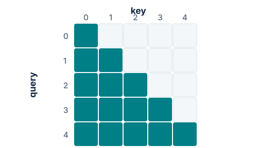
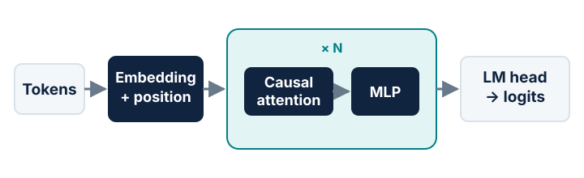
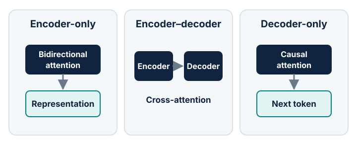

# Session 1 — Transformer from first principles

## Purpose

Build a shared mental model of the decoder-only Transformer, then turn that
model into the smallest implementation students can fully inspect.

This session follows the component-by-component progression of
[The Annotated Transformer](https://nlp.seas.harvard.edu/annotated-transformer/),
but adapts its original encoder–decoder model to the causal decoder-only model
we will train during the course.

## Key ideas

- represent tokens as vectors and add position information;
- derive scaled dot-product attention from queries, keys and values;
- make self-attention causal with a mask;
- combine multiple attention heads;
- compose attention and an MLP through residual connections and normalization;
- project the final hidden states to next-token logits.

## From token IDs to representations

The model receives integer token IDs with shape `B × T`: batch size by sequence
length. An embedding table maps each token to a vector of width `d_model`, giving
`X ∈ B × T × d_model`.

Attention alone does not know whether a token came first or last. The original
Transformer adds sinusoidal position vectors. GPT-2 learns absolute position
embeddings, while many newer LLMs apply rotary position embeddings inside
attention. For the first implementation, the important invariant is simply that
token content and position both reach the block.

## Scaled dot-product attention

Each token representation is projected into a query, a key and a value:

`Q = XW_Q`, `K = XW_K`, `V = XW_V`.

Queries and keys determine which positions interact. Values carry the content
that is mixed. For one attention head:

`Attention(Q, K, V) = softmax(QKᵀ / √d_head + mask)V`.

The division by `√d_head` keeps dot products from growing with the head width.
The softmax acts across key positions, so every query row becomes a probability
distribution over the context it is allowed to see.

## Causal masking

During next-token prediction, position `t` may use tokens `0 … t`, but it must
not inspect future tokens. The causal mask sets forbidden attention logits to a
very negative value before the softmax.

<figure markdown="span">
  { loading=lazy }
  <figcaption>The lower triangle is visible; the upper triangle is blocked.</figcaption>
</figure>

Mask the **logits**, not the post-softmax probabilities. Test causality by
changing a future token and verifying that all earlier output positions remain
unchanged.

## Multi-head attention

Instead of one attention operation at width `d_model`, split the representation
into `n_head` subspaces of width `d_head = d_model / n_head`. Each head performs
its own attention computation, then the head outputs are concatenated and mixed
through an output projection.

Track these shapes explicitly:

- input: `B × T × d_model`;
- projected Q, K and V: `B × n_head × T × d_head`;
- attention scores: `B × n_head × T × T`;
- concatenated head output: `B × T × d_model`.

Multi-head attention changes how information is mixed **between tokens**. The
MLP that follows changes each token representation independently.

## The decoder-only block

The course model repeats one block containing causal self-attention and an MLP.
Residual paths preserve a direct route for information and gradients; the
normalization layers control the scale entering each sublayer.

<figure markdown="span">
  { loading=lazy }
  <figcaption>A minimal decoder-only language model, separated from the original encoder–decoder architecture.</figcaption>
</figure>

The Annotated Transformer implements the original post-norm residual form. Most
modern decoder-only LLMs use a pre-norm arrangement instead:

`X ← X + Attention(Norm(X))`

`X ← X + MLP(Norm(X))`

Do not silently mix the two conventions. The placement of normalization changes
the code path and training behaviour even when the same components are present.

## Logits and next-token prediction

After the final block, a normalization and linear language-model head map every
hidden vector to `V` vocabulary logits. Training compares logits at position
`t` with the token at position `t + 1` using cross-entropy.

The complete data flow is:

`token IDs → embeddings → N Transformer blocks → final norm → LM head → logits → cross-entropy`

The model output and target sequence are shifted by one position. Padding, if
present, must also be excluded from the loss.

## Practical task

Implement the smallest readable decoder-only Transformer:

1. token and position representations;
2. one causal self-attention module;
3. multi-head reshaping and output projection;
4. a pre-norm residual block with an MLP;
5. a repeated block stack, final normalization and LM head;
6. shape, masking and tiny-batch overfitting tests.

## Expected output

A model that completes a forward and backward pass, cannot observe future
tokens, and can overfit a tiny batch. Every intermediate tensor shape should be
explainable without running the code.

## Where this architecture fits

The word *Transformer* covers three high-level families. The distinction is
primarily the direction of self-attention and whether a separate encoder is
connected to the generator.

<figure markdown="span">
  { loading=lazy }
  <figcaption>Three model families built from closely related attention blocks.</figcaption>
</figure>

- **Encoder-only:** bidirectional context produces representations for
  classification, retrieval or token-level prediction; BERT is the canonical
  example.
- **Encoder–decoder:** a bidirectional encoder represents the source and a
  causal decoder generates the target through cross-attention; the original
  Transformer and T5 follow this family.
- **Decoder-only:** causal attention turns one token stream into a next-token
  prediction problem; GPT-style models and most current generative LLMs use
  this family.

This family-level taxonomy is only the first layer of comparison. Sebastian
Raschka's [LLM Architecture Gallery](https://sebastianraschka.com/llm-architecture-gallery/)
shows how decoder-only models then vary along several mostly independent axes:

- dense MLPs versus sparse mixture-of-experts layers;
- MHA, GQA, MLA, local/sliding-window or hybrid attention;
- learned positions, RoPE or layers without explicit positional encoding;
- normalization placement, activation functions and repeated layer recipes.

Use the gallery at the end of the session to compare GPT-2 with a modern model.
First identify what stayed structurally the same, then isolate which components
changed and what memory, optimization or inference trade-off each change targets.

## References

- [The Annotated Transformer](https://nlp.seas.harvard.edu/annotated-transformer/)
  — the main component-by-component reference for this session;
- [Sebastian Raschka — Chapter 17: Encoder- and Decoder-Style Transformers](https://www.sebastianraschka.com/books/ml-q-and-ai-chapters/ch17/)
  — context for the three Transformer families;
- [Sebastian Raschka's LLM Architecture Gallery](https://sebastianraschka.com/llm-architecture-gallery/)
  — visual comparisons across modern language-model architectures.

## Material to add later

- the annotated course implementation;
- attention-value and shape exercises;
- a tiny-batch debugging checklist;
- one guided GPT-2 versus modern-LLM comparison.
