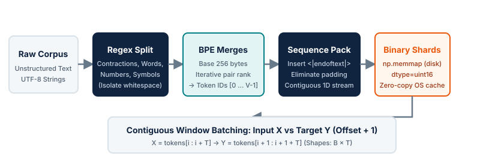

# Session 3 — BPE and the data pipeline

## Purpose

Trace how raw text documents become the exact numerical token tensors ingested
by the model.

Before a language model can perform self-attention or compute cross-entropy loss,
unstructured human text must be transformed into discrete integers. The choice of
tokenization algorithm determines the model's vocabulary, its handling of unknown
characters, its multilingual efficiency, and the sequence length $T$ that dictates
the quadratic cost of attention. Once tokenized, millions of documents must be
packed, indexed, and streamed to GPUs at gigabytes per second without CPU bottlenecks.

This session covers the mathematics and systems engineering of the pretraining
data pipeline, from building a Byte-Pair Encoding (BPE) tokenizer from scratch to
zero-copy memory-mapped binary dataset sharding.

## Key ideas

- the tokenization trade-off: characters versus words versus subword units;
- byte-level Byte Pair Encoding (BPE) and the elimination of out-of-vocabulary (`<unk>`) tokens;
- pre-tokenization regex splitting to prevent semantic boundary pollution;
- vocabulary size trade-offs: compression ratio versus embedding parameter footprint;
- document boundaries, special delimiter tokens (`<|endoftext|>`), and padding waste;
- contiguous sequence packing and cross-document attention;
- binary sharding with `np.memmap` for zero-copy, high-throughput batch streaming.

<figure markdown="span">
  { loading=lazy }
  <figcaption>The pretraining data pipeline: from raw text to contiguous memory-mapped training batches.</figcaption>
</figure>

---

## The tokenization dilemma

Neural networks cannot directly process variable-length character strings; they
require vectors retrieved from a parameter embedding table
$E \in \mathbb{R}^{V \times d_{\text{model}}}$, where $V$ is the vocabulary size.
Choosing how text maps to vocabulary IDs represents a fundamental engineering
compromise:

| Granularity | Vocabulary Size ($V$) | Sequence Length ($T$) | Out-of-Vocabulary Handling | Main Bottleneck |
| :--- | :--- | :--- | :--- | :--- |
| **Character-level** | Very small ($\sim 256$) | Extremely long ($4\times\text{--}5\times$ words) | Zero OOV (all ASCII/bytes covered) | Self-attention scales as $O(T^2)$; long sequences exhaust context windows and inflate FLOPs per word. |
| **Word-level** | Enormous ($> 10^6$) | Short ($\sim 1\times$ word count) | Catastrophic OOV; unseen words, typos, and inflections become `<unk>` | Massive embedding parameters ($V \times d_{\text{model}}$); tail words are seen too rarely to learn good embeddings. |
| **Subword (BPE)** | Tunable ($32\text{k}\text{--}128\text{k}$) | Balanced ($1.2\text{--}1.4\times$ word count) | Zero OOV with byte-level fallback; morphemes are shared across words | Requires a learned merge table and pre-tokenization rules. |

Subword tokenization via **Byte-Pair Encoding** occupies the Pareto-optimal frontier:
common words (*the*, *attention*, *model*) receive dedicated single-token IDs,
while rare words or neologisms decompose gracefully into shared subword morphemes
(*pre* + *train* + *ing*).

---

## Byte-Pair Encoding (BPE) from first principles

Originally invented as a data compression algorithm by Philip Gage (1994), BPE was
adapted to natural language processing by Sennrich et al. (2016) and modernized
for language modeling by Radford et al. (2019, GPT-2).

### 1. Byte-level base vocabulary

Traditional subword algorithms initialized their vocabulary with all unique
characters in the training text. However, Unicode contains over 150,000 characters;
any character missing from the training corpus results in an out-of-vocabulary
(`<unk>`) token during inference.

Byte-level BPE solves this by setting the base vocabulary to the **256 possible byte values**
($\text{0x00}$ through $\text{0xFF}$). Because any UTF-8 string is fundamentally a
sequence of bytes, **a byte-level BPE tokenizer can encode any text in any language
without ever producing an unknown token**.

### 2. The greedy merge algorithm

BPE builds its vocabulary through iterative greedy pair merging:

1. **Initialize:** The vocabulary contains the 256 base bytes plus any reserved special
   tokens (such as `<|endoftext|>`):
   $$V_0 = \{ \text{bytes}([i]) \mid i \in [0, 255] \} \cup \{ \text{"<|endoftext|>"} \}$$
2. **Convert text to byte sequence:** Encode the training corpus into a list of integers
   $S = [b_0, b_1, \dots, b_N]$ where $b_i \in [0, 255]$.
3. **Count adjacent pairs:** Compute frequencies of all consecutive pairs $(S_i, S_{i+1})$.
4. **Select top pair:** Identify the pair $(p_0, p_1)$ with the highest frequency.
5. **Assign new token:** Allocate the next integer ID $v_{\text{new}} = |V|$ and map
   its representation:
   $$\text{repr}(v_{\text{new}}) = \text{repr}(p_0) + \text{repr}(p_1)$$
   Record the merge rule $(p_0, p_1) \mapsto v_{\text{new}}$ in the merge table.
6. **Replace:** Substitute every occurrence of $(p_0, p_1)$ in $S$ with $v_{\text{new}}$.
7. **Iterate:** Repeat steps 3–6 until $|V|$ reaches the target `vocab_size`.

### 3. Encoding new text

To encode unseen text:
1. Break the text into base byte IDs.
2. Search for adjacent pairs that exist in the learned merge table.
3. Identify the candidate pair with the **lowest merge rank** (the pair that was
   learned earliest during training).
4. Replace that pair with its merged token ID.
5. Repeat until no remaining adjacent pairs appear in the merge table.

---

## Pre-tokenization & regex splitting

A naive BPE algorithm run directly on raw byte streams produces undesirable merges
across semantic boundaries. For example, if the sequence `"the dog."` appears
frequently, a naive merge could merge the trailing period `.` with the following
word's opening character: `".T"` $\to$ `".The"`.

To prevent punctuation, whitespace, and grammatical categories from contaminating
word roots, modern tokenizers apply a **pre-tokenization regular expression** before
running BPE merges. The GPT-2 regex illustrates this principle:

```python
import re

# GPT-2 pre-tokenization regex pattern
GPT2_SPLIT_REGEX = re.compile(
    r"""'s|'t|'re|'ve|'m|'ll|'d| ?\p{L}+| ?\p{N}+| ?[^\s\p{L}\p{N}]+|\s+(?!\S)|\s+"""
)
```

This pattern segments the text stream into semantic categories:
- `'s|'t|'re|...`: isolates English contractions so the apostrophe and suffix do
  not merge into the preceding noun.
- ` ?\p{L}+`: groups sequences of letters (words) with an optional leading space.
- ` ?\p{N}+`: groups sequences of digits (numbers) with an optional leading space.
- ` ?[^\s\p{L}\p{N}]+`: groups punctuation and symbols.
- `\s+(?!\S)`: groups whitespace sequences that are not trailing spaces.

Crucially, **BPE merges are only permitted within each individual regex chunk,
never across chunks**. This ensures that numbers, punctuation, and words maintain
clean, independent token representations.

---

## Vocabulary size trade-offs

Choosing the target vocabulary size $V$ involves an architectural trade-off
between token sequence length $T$ and parameter memory:

$$V \in \{ 32\text{k}, 50\text{k}, 128\text{k}, 200\text{k} \}$$

### Compression ratio

The compression ratio measures how many raw UTF-8 bytes are packed into a single token:

$$\text{Compression Ratio} = \frac{\text{Total UTF-8 Bytes}}{\text{Total Tokens}}$$

- **GPT-2 ($V = 50,257$):** Yields $\sim 3.7$ characters per token on English text.
- **Llama 3 ($V = 128,256$):** Yields $\sim 4.5$ characters per token on English text,
  and achieves $15\%\text{--}25\%$ higher compression on multilingual text and source code.
- **GPT-4o ($V \approx 200,000$):** Significantly reduces token counts for non-Latin
  scripts (Arabic, Hindi, Chinese), directly reducing the per-word generation latency.

### Parameter footprint vs attention FLOPs

1. **Memory cost:** The token embedding table $E$ and language-model head
   $W_{\text{head}}$ consume $2 \times V \times d_{\text{model}}$ parameters (or
   $V \times d_{\text{model}}$ if weights are tied). For $d_{\text{model}} = 4096$,
   increasing $V$ from $32\text{k}$ to $128\text{k}$ adds $\sim 393\text{M}$ parameters
   purely in the embedding layer.
2. **Compute savings:** A higher compression ratio means the same document requires
   $20\%$ fewer tokens. Because self-attention complexity scales quadratically as
   $O(T^2)$, a $20\%$ reduction in sequence length $T$ cuts self-attention compute
   by $36\%$, and cuts KV-cache VRAM consumption during inference by $20\%$.
3. **Tail token sparsity:** A vocabulary that is too large relative to the training
   corpus contains rare tokens that appear only a few times during pretraining.
   These parameters receive sparse gradient updates and fail to learn meaningful representations.

---

## Document boundaries & sequence packing

Pretraining corpora consist of millions of independent documents of varying length
(from a 50-token social media post to a 20,000-token Wikipedia article).

### The cost of batch padding

If documents are placed into batches with naive zero-padding up to the model's
maximum context length $T = 2048$:

```text
Batch 0: [Doc 1 (250 tokens)] [PAD] [PAD] ... [PAD (1798 tokens)] -> 88% wasted FLOPs
Batch 1: [Doc 2 (800 tokens)] [PAD] [PAD] ... [PAD (1248 tokens)] -> 61% wasted FLOPs
```

In typical web crawl distributions, **$30\%\text{--}50\%$ of total training FLOPs
are wasted computing forward and backward passes over useless padding tokens**.

### Contiguous sequence packing

Instead of padding, production pipelines **pack documents contiguously**:
1. Encode each document independently into a 1D token list.
2. Append a special delimiter token `<|endoftext|>` after each document.
3. Concatenate all token lists into a single, seamless 1D array of billions of tokens.
4. Slice the 1D array into contiguous chunks of length $T$.

```text
1D Token Stream:
[Doc 1 tokens ... ] [<|endoftext|>] [Doc 2 tokens ... ] [<|endoftext|>] [Doc 3 ... ]
|------- Chunk 0 (T tokens) -------|------- Chunk 1 (T tokens) -------| ...
```

This guarantees **100% token packing efficiency with zero wasted padding FLOPs**.

### Cross-document attention

When documents are packed contiguously, a training chunk will occasionally contain
the end of Document A followed by the start of Document B. Because standard causal
masking allows every token to attend to all preceding positions in the chunk,
tokens in Document B can technically attend to tokens in Document A.

In large-scale pretraining, this cross-document attention has been proven to have
negligible negative impact on language modeling performance. However, for fine-tuning
or strict domain adaptation, modern attention kernels (such as FlashAttention's
variable-length `flash_attn_varlen_func`) allow passing cumulative sequence length
offsets (`cu_seqlens`) to apply **block-diagonal causal masking**, preventing attention
leakage across document boundaries without introducing padding tokens.

---

## High-throughput binary sharding with `np.memmap`

During pretraining, GPUs consume thousands of tokens per second per rank. Loading
raw text or JSONL files on the fly and tokenizing with Python strings creates an
immediate CPU bottleneck, leaving expensive GPUs starved for data.

### Binary representation

Because vocabulary IDs rarely exceed $65,535$ for models with $V \le 65\text{k}$,
each token can be stored as an **unsigned 16-bit integer** (`np.uint16`, 2 bytes per token).
For large vocabularies ($V > 65\text{k}$ like Llama 3), unsigned 32-bit integers
(`np.uint32`, 4 bytes per token) are used.

A dataset of 1 billion tokens packed as `uint16` occupies exactly $2.0\text{ GB}$ of disk space:

```python
import numpy as np

# Convert packed token ID list to compact uint16 binary file
arr = np.array(all_token_ids, dtype=np.uint16)
with open("shard_00000.bin", "wb") as f:
    f.write(arr.tobytes())
```

### Memory-mapped dataset access

Using NumPy's `np.memmap`, training workers open the binary shard directly:

```python
class BinaryShardedDataset:
    def __init__(self, bin_path: str, dtype=np.uint16):
        # Reads file metadata; does NOT load file contents into RAM
        self.data = np.memmap(bin_path, dtype=dtype, mode="r")
        self.num_tokens = len(self.data)

    def get_batch(self, batch_size: int, block_size: int):
        # Randomly sample batch starting indices
        ix = np.random.randint(0, self.num_tokens - block_size, size=batch_size)
        x = np.stack([self.data[i : i + block_size].astype(np.int64) for i in ix])
        # Target Y is shifted by exactly 1 position
        y = np.stack([self.data[i + 1 : i + 1 + block_size].astype(np.int64) for i in ix])
        return torch.from_numpy(x), torch.from_numpy(y)
```

Memory mapping provides decisive systems advantages:
1. **Instant startup:** Opening a $50\text{ GB}$ shard takes microseconds because
   only the file descriptor and virtual address mapping are initialized.
2. **Zero-copy OS page caching:** The operating system kernel automatically pages
   data blocks from disk into RAM when accessed. Multiple DataLoader worker processes
   access the exact same shared physical memory without duplicating data in RAM.
3. **Shifted next-token batching:** Extracting input $X$ from $[i : i + T]$ and target
   $Y$ from $[i + 1 : i + 1 + T]$ requires only a single contiguous array slice,
   guaranteeing that $Y_{b, t} = X_{b, t+1}$.

---

## Practical task

Construct and verify the complete tokenizer and data pipeline:

1. **BPE from scratch:** Implement the greedy pair-counting and merging algorithm
   starting from raw UTF-8 bytes up to a custom vocabulary size.
2. **Special token handling:** Ensure `<|endoftext|>` is properly registered as a
   distinct token ID and preserved during encoding.
3. **Compression profiling:** Compare the token count against raw byte length on
   sample sentences and calculate the compression ratio.
4. **Document packing:** Pack multiple text documents into a contiguous binary shard
   delimited by `<|endoftext|>`.
5. **Batch slicing and invariant verification:** Memory-map the binary shard, sample
   batches $(X, Y)$, and programmatically verify the next-token target shift:
   `assert (Y[:, :-1] == X[:, 1:]).all()`.

## Expected output

A self-contained data pipeline demonstrating:
- an educational BPE tokenizer that trains merge rules from scratch and decodes back to text losslessly;
- measured token compression ratios ($\text{bytes} / \text{tokens} > 1.5$);
- packed `uint16` binary dataset shards on disk;
- fast memory-mapped batch generation with verified $Y_{b, t} = X_{b, t+1}$ alignment.

---

## Practical companion guide

!!! tip "Practical Lab: BPE and the Data Pipeline"
    To explore the hands-on implementation for this session:

    👉 **Follow the companion implementation** to train a BPE tokenizer from scratch, inspect subword merge rules, pack documents, and stream memory-mapped batches:

    - **Lab script:** [`companion/scripts/03_prepare_dataset.py`](https://github.com/jonathanlys01/llm-course/blob/main/companion/scripts/03_prepare_dataset.py)
    - **Tokenizer implementation:** [`companion/minilm/tokenizer.py`](https://github.com/jonathanlys01/llm-course/blob/main/companion/minilm/tokenizer.py)
    - **Dataset module:** [`companion/minilm/data.py`](https://github.com/jonathanlys01/llm-course/blob/main/companion/minilm/data.py)
    - **Unit tests:** [`companion/tests/test_session_03_data.py`](https://github.com/jonathanlys01/llm-course/blob/main/companion/tests/test_session_03_data.py)

    Run the verification suite:
    ```bash
    cd companion
    uv run pytest tests/test_session_03_data.py -v
    uv run python scripts/03_prepare_dataset.py
    ```

---

## References

- [Sebastian Raschka (2025) — Implementing A Byte Pair Encoding (BPE) Tokenizer From Scratch](https://sebastianraschka.com/blog/2025/bpe-from-scratch.html)
  — step-by-step tutorial and educational implementation of BPE in Python.
- [Andrej Karpathy — minbpe & Let's build the GPT Tokenizer](https://github.com/karpathy/minbpe)
  — clean, minimal reference implementation of the GPT-4 BPE tokenizer and regex engine.
- [Philip Gage (1994) — A New Algorithm for Data Compression](https://www.derkeiler.com/Large-Globals/Total/Archive/0130/0130.html)
  — the original paper introducing Byte Pair Encoding.
- [Sennrich et al. (2016) — Neural Machine Translation of Rare Words with Subword Units](https://arxiv.org/abs/1508.07909)
  — first application of BPE to neural NLP to solve the out-of-vocabulary problem.
- [Radford et al. (2019) — Language Models are Unsupervised Multitask Learners](https://cdn.openai.com/better-language-models/language_models_are_unsupervised_multitask_learners.pdf)
  — GPT-2 paper introducing byte-level BPE with pre-tokenization regex splitting.
