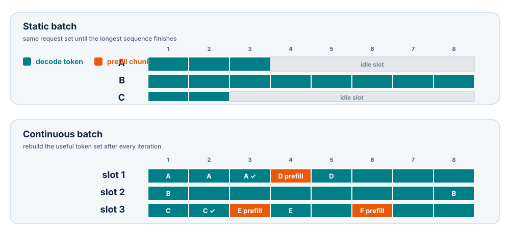

# Session 12 — Serving systems

## Purpose

Move from one correct cached request to a system that admits, schedules and
retires many requests under finite compute, KV memory and latency budgets.

The session uses two complementary explanations:

- [Continuous batching from first principles](https://huggingface.co/blog/continuous_batching)
  derives the mechanism from attention masks, KV caching, chunked prefill and
  ragged batches;
- [Inside vLLM: Anatomy of a High-Throughput LLM Inference System](https://vllm.ai/blog/2025-09-05-anatomy-of-vllm)
  maps those ideas onto a real engine, scheduler, cache manager and serving
  stack.

The goal is not to memorize one engine's class names. It is to understand the
state machine and resource trade-offs shared by modern LLM serving systems.

## Learning goals

By the end of the session, students should be able to:

- distinguish model execution from online serving infrastructure;
- explain static, dynamic and continuous batching;
- model scheduling as a token and KV-block allocation problem;
- explain paged KV caches, block tables and fragmentation;
- reason about decode priority and chunked prefill;
- state when prefix caching helps and when it cannot;
- measure TTFT, ITL/TPOT, end-to-end latency, throughput and goodput;
- design a workload that exposes rather than hides scheduler trade-offs.

## From a decoder to an engine

A model forward pass accepts tensors and returns logits. A serving engine must
also handle request arrival, tokenization, scheduling, memory allocation,
sampling, stopping, streaming and failures.

A useful decomposition is:

| Component | Responsibility |
| --- | --- |
| input processor | validate, tokenize and attach request metadata |
| waiting/running queues | track request lifecycle |
| scheduler | choose work for the next engine step |
| KV-cache manager | allocate, map, share and free cache blocks |
| model executor | prepare tensors and run GPU forward passes |
| sampler | select next tokens under each request's policy |
| output processor | detokenize, stream, stop and finalize |
| API/async layer | accept concurrent clients and apply backpressure |

The core loop is conceptually small:

```text
admit new requests
    → schedule token work
    → allocate/reuse KV blocks
    → run one model step
    → sample and append tokens
    → stream outputs
    → finish requests and free blocks
    → repeat
```

The quality of a serving system comes from how these states interact under load.

## Two kinds of work share the GPU

### Prefill requests

- process many prompt tokens;
- produce the first output token and populate KV cache;
- use larger matrix multiplications;
- are often compute-bound for substantial prompts;
- determine much of TTFT.

### Decode requests

- process one new query token per active sequence;
- read model weights and the existing KV cache;
- are often memory-bandwidth-bound;
- repeat until a stop condition;
- determine ITL/TPOT and streaming smoothness.

A long prefill can improve bulk throughput while blocking dozens of decode
tokens. A scheduler therefore balances two different kinds of GPU work, not a
homogeneous queue.

## Why static batching wastes work

Suppose four requests start together with different prompt and output lengths.
A rectangular batch pads prompts to the same length. During generation, shorter
requests finish first but their batch slots remain unused until the longest
request ends.

Waste comes from:

- prompt padding;
- decode iterations after a sequence has finished;
- waiting for a fixed batch to fill;
- inability to admit a new request into a vacated slot.

Static batching is efficient only when lengths are similar and the batch is
known in advance—conditions that online traffic rarely satisfies.

## Continuous batching

Continuous batching rebuilds the scheduled batch at every engine step.
Finished requests leave immediately and waiting requests can enter. Modern
kernels treat tokens from different sequences as a **ragged** or flattened
token set with metadata that preserves sequence boundaries, so padding is not
the organizing principle.

The Hugging Face derivation combines three mechanisms:

1. **KV caching** avoids recomputing prior token representations;
2. **chunked prefill** makes prompt work divisible under a token budget;
3. **ragged batching plus dynamic scheduling** packs useful work and replaces
   finished requests.

At one step the batch may contain:

- one decode token from each running request;
- chunks of prompt tokens from newly admitted or partially prefetched requests;
- no padding between logical sequences.

Attention metadata ensures each query reads only its own visible KV context.

<figure markdown="span">
  { loading=lazy }
  <figcaption>Continuous batching turns vacated capacity into useful work at the next engine step.</figcaption>
</figure>

## Schedule tokens, not request count

A request count hides enormous variation: one request may contribute one decode
token while another offers a 16k-token prompt. A useful step budget is the
number of new tokens to compute, together with available KV blocks.

A decode-first policy can be sketched as:

1. reserve one token for each running decode request that fits;
2. use the remaining token budget for prefill chunks;
3. allocate required KV blocks;
4. preempt or defer work when memory is insufficient.

Prioritizing decode protects ITL for users already receiving tokens. Too much
decode priority can starve new requests and inflate TTFT. Too much prefill work
can create visible pauses in every running stream.

The scheduler policy is therefore a service objective encoded as an algorithm.

## Chunked prefill

Without chunking, one long prompt can monopolize an engine step and delay all
decode work. Chunked prefill limits the number of prompt tokens processed in a
step and stores intermediate K/V so the prompt continues later.

Benefits:

- fits long prompts under activation and token budgets;
- fills otherwise unused capacity beside decode work;
- caps head-of-line blocking from one request;
- gives the scheduler finer-grained control.

Costs:

- more engine steps and scheduling overhead;
- repeated launches with smaller matrices;
- potentially worse TTFT for the chunked request;
- policy tuning between prompt progress and decode latency.

Chunk size is not a universal constant. It depends on GPU, model, traffic and
the target latency distribution.

## Paged KV-cache management

A contiguous cache reserves space for a request's maximum sequence length.
Online workloads do not know their final lengths and finish at different times,
so large contiguous reservations waste memory and create fragmentation.

Paged allocation divides cache storage into fixed-size blocks. A request owns a
logical sequence of block IDs stored in a block table. Its logical tokens can
map to non-contiguous physical blocks.

```text
request tokens:  [0 ........ 15] [16 ....... 31] [32 ...]
logical blocks:       0               1             2
physical blocks:     417             92            811
```

The cache manager maintains a free-block pool, allocates new blocks as a request
grows, and returns them when it finishes. A paged-attention kernel follows the
block table while reading K/V.

### What paging solves

- avoids reserving maximum length for every request;
- reduces external fragmentation;
- makes allocation and reclamation block-granular;
- supports sharing complete prefix blocks;
- makes preemption/accounting explicit.

### What paging does not solve

- the cache still grows linearly with live tokens;
- the final partial block has internal fragmentation;
- block tables and indirection add metadata and kernel complexity;
- too-small blocks increase metadata/lookup overhead;
- too-large blocks waste more tail capacity.

Use Session 11's formula to convert free blocks into token and request capacity.

## Prefix caching

If multiple requests begin with the same token prefix—such as a system prompt,
few-shot examples or a shared document—their prefix K/V is identical under the
same model state. The engine can compute complete prefix blocks once, hash them,
and reuse those physical blocks.

A block hash typically depends on:

- previous block hash, preserving prefix order;
- token IDs in the current block;
- model/adaptor or multimodal identity where relevant;
- an optional isolation salt.

Only complete blocks are generally reusable. A partial final prefix block may
need recomputation because its unused positions will be extended by a different
suffix.

Prefix caching improves **prefill** time and compute. It does not make decode
attention over the prefix free: each generated query still reads the visible
K/V unless another mechanism changes that cost.

It helps when prefixes are long, repeated and reused before eviction. It adds
little when prompts are unique or short.

## Preemption and admission control

When the KV pool cannot satisfy all running requests, the engine must choose:

- reject or queue new requests;
- preempt a lower-priority request;
- recompute evicted state later;
- swap/offload cache to slower memory;
- cap maximum sequence length or concurrency.

Each choice moves cost among latency, throughput, memory and fairness. An
unbounded queue can preserve acceptance while making latency meaningless.
Report queue time separately from execution time and define a maximum load or
backpressure policy.

## CUDA graphs and stable execution shapes

GPU kernel launch overhead matters during small decode steps. CUDA graphs can
capture a sequence of launches and replay it with lower CPU overhead. Serving
engines often warm up and capture selected batch sizes, then pad or choose among
captured shapes.

This creates a second notion of padding: logical ragged sequences need not pad
to equal lengths, yet the executor may pad the number of scheduled tokens to a
captured graph size. Distinguish semantic token waste from an implementation's
shape specialization.

## Latency and throughput metrics

For request arrival time \(t_0\), first-token time \(t_1\), completion
\(t_f\), and \(N\) output tokens:

\[
\mathrm{TTFT} = t_1 - t_0,
\]

\[
\mathrm{E2E} = t_f - t_0,
\]

\[
\mathrm{TPOT} = \frac{t_f-t_1}{N-1}
\]

for \(N>1\). TPOT is a per-request average; **ITL** is the distribution of
individual gaps between streamed tokens.

Also report:

- input tokens/s and output tokens/s;
- requests/s;
- concurrent running and queued requests;
- KV utilization and preemption count;
- p50, p90, p95 and p99—not only the mean;
- **goodput:** requests/s that satisfy declared TTFT and TPOT objectives.

Throughput without an SLO can be raised by batching until latency is unusable.
Latency measured with one request says little about capacity under load.

## Build a representative workload

Describe a workload as distributions, not one prompt:

- arrival process or trace;
- prompt-length distribution;
- output-length distribution;
- shared-prefix frequency and length;
- sampling and stop settings;
- priority classes;
- warm/cold cache policy;
- maximum queue and concurrency.

### Closed-loop versus open-loop load

- **Closed loop:** each client sends a new request after the previous one
  finishes. When the server slows, offered load falls, which can hide overload.
- **Open loop:** arrivals follow an external rate independent of completions.
  Queueing and tail-latency collapse become visible.

Use closed-loop tests for controlled saturation curves and open-loop tests for
service behavior at a declared arrival rate. Label them clearly.

## Benchmark matrix

At minimum compare:

| Axis | Suggested values |
| --- | --- |
| prompt length | short / medium / long |
| output length | short / long |
| concurrency | 1, low, saturation, overload |
| prefix reuse | none / shared system prompt / long shared prefix |
| prefill policy | unchunked / two chunk sizes |
| scheduling | default / one deliberate alternative |

Keep model, dtype, tensor-parallel degree, GPU allocation and generation policy
fixed unless they are the tested variable. Force or record output lengths so
EOS behavior does not confound timing.

## Read the results as a system

Common patterns:

| Observation | Likely mechanism | Evidence to inspect |
| --- | --- | --- |
| throughput rises, then p99 explodes | queueing near saturation | queue depth and arrival rate |
| long prompts cause decode stalls | prefill monopolizes steps | scheduled tokens by phase |
| prefix caching changes nothing | low reuse or sub-block prefix | cache-hit tokens and block hashes |
| OOM below predicted capacity | block/workspace overhead or fragmentation | free blocks and memory snapshot |
| high GPU utilization, poor goodput | oversized batches violate latency target | batch/token budget and TPOT |
| low utilization under load | CPU/tokenization/scheduler bottleneck | CPU trace and engine-step gaps |

Do not attribute a result to “continuous batching” in general. Identify whether
the observed change came from admission, ragged packing, token budget, cache
allocation, chunking or request replacement.

## In-class investigation

### Part A — schedule by hand

Given four requests with prompt/output lengths and a 12-token step budget:

1. schedule decode tokens first;
2. fill the remainder with prefill chunks;
3. allocate KV blocks of four tokens;
4. retire completed requests and admit waiting ones;
5. calculate wasted capacity and queue delay for three steps.

Repeat with a prefill-first policy and compare TTFT and ITL qualitatively.

### Part B — cache allocator

For a fixed block count and block size, trace allocation for requests that
arrive and finish at different lengths. Compare contiguous maximum-length
reservation with paged allocation, including partial-tail waste.

### Part C — serving report

Produce four plots:

1. throughput versus offered load;
2. p50/p95/p99 TTFT versus offered load;
3. p50/p95/p99 TPOT or ITL versus offered load;
4. KV utilization and queue depth over time.

Mark the saturation point and the highest configuration that satisfies the
declared latency objective.

## Exit ticket

1. Why can continuous batching mix prefill and decode tokens without
   cross-request attention?
2. What does chunked prefill protect, and what can it worsen?
3. Why does a paged cache reduce external but not all internal fragmentation?
4. Why does prefix caching improve TTFT but not remove decode's KV reads?
5. What is the difference between peak throughput and goodput?

## Expected output

A serving report that declares the workload and SLO, explains the scheduler and
cache configuration, reports latency distributions and throughput under load,
and connects every major result to queue, token, block or GPU evidence.

## References

- [Inside vLLM: Anatomy of a High-Throughput LLM Inference System](https://vllm.ai/blog/2025-09-05-anatomy-of-vllm)
  — engine core, scheduling, paged attention, prefix caching and scale-out;
- [Continuous batching from first principles](https://huggingface.co/blog/continuous_batching)
  — visual derivation of KV caching, chunked prefill and ragged scheduling;
- [Efficient Memory Management for Large Language Model Serving with PagedAttention](https://arxiv.org/abs/2309.06180)
  — the memory-allocation and scheduling analysis behind vLLM;
- [vLLM documentation](https://docs.vllm.ai/)
  — current configuration and benchmark interfaces.
